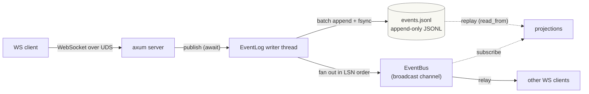
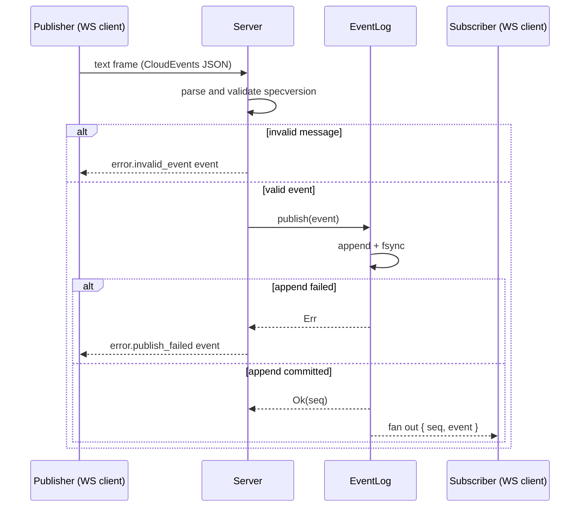
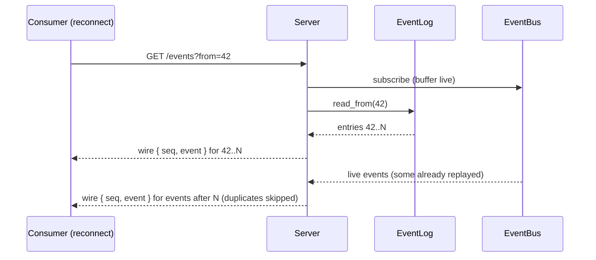
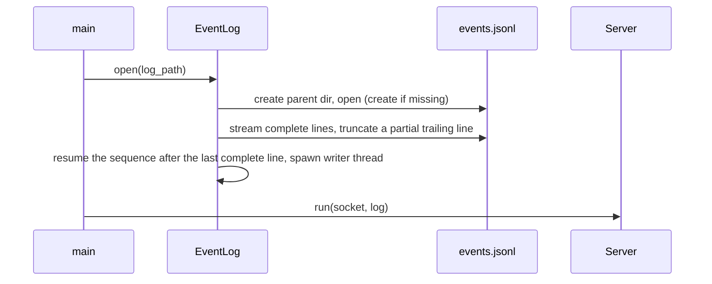

# agentd architecture

`agentd` is an always-on agent daemon. Components coordinate in a
choreography style: they publish events onto an in-process event bus and react
to the events published by others; there is no central orchestrator. Clients
connect over a WebSocket served on a Unix domain socket.

The nouns are fixed in [vocabulary](vocabulary.md); this document uses them
without redefining them.

Every event is written to a durable append-only JSONL log **before** it is
fanned out, so the log is the source of truth and a live subscriber can never
see an event that is not already durable. Read models are rebuilt from the log
rather than from a second source of truth. Every event that leaves the log
carries its one-based position (`Seq`) alongside it, so a consumer can record
how far it has processed and resume from there.

## Components



| Component          | Crate           | Role                                                                                                              |
| ------------------ | --------------- | ----------------------------------------------------------------------------------------------------------------- |
| Unix domain socket | `agentd`        | Transport and single-instance boundary; a stale socket file is removed, a live one reports `AlreadyRunning`.       |
| WebSocket endpoint | `agentd`        | Ingress and egress protocol. Connections authenticate with a bearer token (see [Access control](#access-control)); inbound text frames must parse as CloudEvents and pass validation; outbound messages pair the event with its `seq` (see [Wire envelope](#wire-envelope)) and support `?from=` to resume. |
| `EventBus`         | `agentd-events` | Internal live fanout to subscribers via a `tokio::sync::broadcast` channel (capacity 1024 per subscriber); only `EventLog` publishes to it. |
| `EventLog`         | `agentd-events` | Durable write path: owns the writer thread, the log sequence number, the JSONL file, and the live fanout.           |
| JSONL log          | `agentd-events` | Append-only source of truth; one CloudEvents envelope per line, position = one-based line number (`Seq`).          |
| Projections        | `agentd-events` | Read models derived from the log, resuming from an `applied_seq` checkpoint (`agentd_events::projection`).          |
| Node               | `agentd-node`   | Long-lived client that consumes `/events` and keeps a SQLite projection current (see [node](node.md)).               |
| Inference endpoint | `agentd`        | Model gateway on the same Unix socket, behind the `infer` claim; streams transient deltas that are never logged (see [inference](inference.md)). |
| `Provider`         | `agentd-inference` | Provider-neutral completion trait; the daemon ships a deterministic `FakeProvider`.                              |
| Agent node         | `agentd-node`   | Node specialization that runs the agent loop: reacts to `agent.inbox`, infers, runs the shell tool, publishes (see [inference](inference.md)). |
| Session manager    | `agentd`        | Supervises third-party tools as confined children and, through a per-protocol `Bridge`, gives them a `CloudEvents` face (see [session](session.md)). |

## Event model

Every event on the bus and in the log is a CloudEvents 1.0 envelope:

| CloudEvents attribute | Rust field    | Value / format                                              |
| --------------------- | ------------- | ----------------------------------------------------------- |
| `id`                  | `id`          | UUID version 7, so IDs order by creation time                |
| `source`              | `source`      | `urn:mokmokd` for daemon-produced events                     |
| `specversion`         | `specversion` | `1.0`, validated on ingress                                  |
| `type`                | `r#type`      | dotted type, e.g. `error.lagged`, `error.publish_failed`    |
| `time`                | `time`        | RFC 3339 UTC; optional per the specification                 |
| `data`                | `data`        | Arbitrary JSON payload                                       |

```json
{
  "id": "0199b7ea-8f4a-7d12-9c3a-2f8b1e4d6a90",
  "source": "urn:mokmokd",
  "specversion": "1.0",
  "type": "test.event",
  "time": "2026-09-13T12:00:00.123456Z",
  "data": { "value": 1 }
}
```

### Wire envelope

Outbound WebSocket messages pair the event with its position:

```json
{
  "seq": 42,
  "event": {
    "id": "0199b7ea-8f4a-7d12-9c3a-2f8b1e4d6a90",
    "source": "urn:mokmokd",
    "specversion": "1.0",
    "type": "test.event",
    "time": "2026-09-13T12:00:00.123456Z",
    "data": { "value": 1 }
  }
}
```

`seq` is the one-based log position, or `null` for a transient daemon notice
that is not part of the log (for example `error.lagged`). The position is
transport metadata and is never written into the JSONL log, whose lines are
CloudEvents (plus the hash-chain attributes below). Inbound frames are a bare
CloudEvent; the daemon assigns the position on append.

A consumer's saved position (its cursor) must only advance on a message whose
`seq` is non-null; notices carry `null` and must not overwrite it.

## Access control

The daemon is not an open bus. Every connection presents an
`Authorization: Bearer <token>` header whose token maps to a set of claims:

| Claim       | Grants                                                                              |
| ----------- | ----------------------------------------------------------------------------------- |
| `read`      | Subscribe to the stream (replay and live).                                            |
| `publish`   | Append non-reserved events.                                                           |
| `authority` | Publish the reserved daemon-authority types `error.*`, `sandbox.*`, and `session.*`.  |
| `infer`     | Request model inference on `/inference`.                                              |

A read-only connection cannot append; a publish attempt is answered with an
`error.unauthorized` notice. A token without `authority` cannot publish a
reserved type, so a client cannot forge `sandbox.permission.granted`/`denied`
and hijack the approval flow, nor forge `session.*` lifecycle. A token without
`infer` cannot reach `/inference`. The daemon overwrites the client-supplied
`source` (with the authenticated principal's) and `time` (with its own), and
validates `specversion`, `type`, and `id`, so an event's provenance in the log
is daemon-owned.

Tokens live in a JSON file (`--token-file`) that must not be readable or
writable by group or other users; the daemon refuses to start otherwise. The
defaults follow the XDG Base Directory specification: the token file (and a
`providers.json`) default to `$XDG_CONFIG_HOME/agentd` (`~/.config/agentd`), the
durable log to `$XDG_DATA_HOME/agentd` (`~/.local/share/agentd`), and the socket
to `$XDG_RUNTIME_DIR/agentd` (falling back to `$TMPDIR/agentd`, since macOS does
not set `XDG_RUNTIME_DIR`). The socket's directory and the token file are
created mode `0700`/`0600`. The token is a **capability**:
strong isolation from a compromised same-uid agent depends on the agent running
inside the sandbox with the token file in `deny_read` (see
[sandbox](sandbox.md)); a sandboxed node holds only `read`, `publish`, and
`infer`, so it can neither forge daemon-authority events nor reach the network.

`agentd init [--config-dir <path>]` creates the config directory (mode `0700`)
and a token file with three clients — `user` (`read`, `publish`), `agent`
(`read`, `publish`, `infer`), and `admin` (`authority`) — plus a mode-`0600`
`<name>.token` file per client for tools like `agentd-agent` and
`agentd-publish`. It also writes a `providers.json` template naming a keyless
local server, which `serve` loads automatically (see
[inference](inference.md)); an existing provider config is never overwritten. It
refuses to overwrite an existing token file without `--force`, and prints the
secrets once. `serve` creates the socket, its directory, and the log, but never
generates a token file: it refuses to start without one and points at `init`.

## Sequences

### Publishing and relaying an event



### Durable append (group commit)

```mermaid
sequenceDiagram
    participant S as Server
    participant Q as writer queue (bounded)
    participant W as Writer thread
    participant D as events.jsonl

    S->>Q: publish(event) (awaits an ack)
    W->>Q: drain the queue into one batch
    W->>D: write one JSON line per event
    W->>D: fsync once for the whole batch
    W->>W: fan out in LSN order, then ack each publish
    Note over W,D: one write and one fsync per batch; concurrent publishers share the fsync
```

The writer thread owns the file and the sequence number, so the log order is
the delivery order. `publish` returns only after the append has been synced;
events that cannot be synced are reported as errors instead of being silently
dropped.

### Backpressure and lag

The writer queue is bounded, so a slow disk backpressures publishers rather
than growing memory or losing events. Live subscribers are ordinary broadcast
subscribers: a subscriber that cannot keep up loses its live stream and
observes an `error.lagged` event, but the log is unaffected because it was
written before the fanout.

### Resuming from a position

A consumer persists the last `seq` it applied and reconnects with
`GET /events?from=<seq>` (inclusive). The server subscribes to the live bus
first, replays history from `from` to the end of the log, then continues live,
skipping any event it already sent:



If the live buffer overflows during a long replay, the server re-reads the
durable tail from the last sent position instead of dropping events, so a
resumed consumer never silently skips a position. A position outside
`1..=tail+1` (with `tail` the last committed position) is answered with an
`error.resume_out_of_range` notice and the connection is closed; a replay
failure likewise closes after an `error.replay_failed` notice, because
continuing would leave a permanent gap. Without `from`, a consumer is live-only
and a lag is reported as `error.lagged`, as before. A resuming consumer then
receives a transient `daemon.caught_up` notice once the replay is applied, so a
client that reacts to the log (the agent) can finish an interrupted turn from
the replayed state.

### Startup and recovery



## Log format and recovery strategy

The log is newline-delimited JSON. Each line is a CloudEvents envelope plus two
extension attributes, `prevhash` and `chainhash`, that form a tamper-evident
hash chain; the schema is otherwise stable when extension attributes appear and
the log stays consumable by ordinary tooling (`jq`, `rg`, DuckDB). There is no
migration list: attributes are read on demand.

- The position of a line is its one-based line number, exposed as `Seq`.
- Each line's `chainhash` is SHA-256 over the previous line's `chainhash` and
  the canonical JSON of the event with the chain attributes removed; the first
  line's `prevhash` is sixty-four zeroes. Editing, reordering, or dropping a
  chained line breaks the chain from that position on, which
  `agentd_events::verify_chain` (and `agentd verify-log`) reports at the failing
  position. A line without the attributes (a log predating the chain) is
  reported as unchained. The chain is unkeyed, so it detects partial tampering
  but not a full rewrite from genesis — an HMAC with a key the writer keeps, or
  an external anchor, is the follow-up.
- A crash mid-append can leave a partial trailing line; recovery truncates it
  and keeps every complete line, so the log always ends on a line boundary. It
  resumes the chain from the last complete line's hash.
- The log is at-least-once across a writer failure: an event that was written
  but not acknowledged may survive, so a retrying publisher can append it
  twice. Consumers deduplicate by `Event::id`.
- Positions are not stored in the file; they are derived from line numbers and
  attached as `agentd_events::LogEntry` on the live bus and the WebSocket API,
  so the file stays a CloudEvents stream. A consumer resumes by passing the last
  position it applied to `GET /events?from=`.
- History queries read the log directly (DuckDB over the JSONL, or `rg`);
  stateful read models replay it through `projection::catch_up`, which resumes
  from the projection's `applied_seq`.

## Nodes

A node is a long-lived client that consumes the log and keeps a SQLite
projection current (see [node](node.md)). It connects to `/events` with
`?from=<checkpoint + 1>`, selects the events it cares about, and writes the
reducer's state change and the checkpoint in **one SQLite transaction**, so a
restart resumes without gaps or duplicates. An event the node is not interested
in still advances the checkpoint, so it is not re-read.

The JSONL log is permanent; the SQLite file is a projection that
can always be rebuilt from it. The log is not a write-ahead log and is never
truncated to a checkpoint, and the projection is not a second source of truth.

## Extension model

The daemon is extended out of process. An extension consumes and produces
CloudEvents 1.0 JSON over the WebSocket event API (a Unix socket), authenticating
with a bearer token that carries the claims it needs; any external program in any
language qualifies and no crate is required. There is no
in-process extension mechanism: components that need in-process access to the
event contract are first-class crates, not plug-ins.

The current structure follows these rules:

- `agentd-events` holds the event contract (`Event`, `SPEC_VERSION`,
  `DAEMON_SOURCE`), the live fanout (`EventBus`), and the durable log
  (`EventLog`) with its projection helpers. Every other crate depends on it
  and must never depend on the `agentd` binary crate.
- The durable JSONL event log is core: it lives in `agentd-events`, is the
  source of truth, and is never feature-gated.
- `agentd-node` depends on `agentd-events` and `agentd-inference` and is neither
  the daemon binary nor an extension: it is the client-side node library and
  binaries (the generic projection node and the `agentd-agent` agent node), run
  out of process, and eventually inside the sandbox; see [node](node.md) and
  [inference](inference.md).
- `agentd-sandbox` is a first-class crate like `agentd-node`: it depends on
  `agentd-events` only, and `agentd` exposes it behind the `sandbox` feature,
  which is **on by default**. The daemon's purpose is to supervise a confined
  agent, so `serve --session-command` and `up` need it; a
  `--no-default-features` build is the slim daemon that serves the event API and
  `/inference` alone.
- `agentd-inference` holds the provider-neutral inference contract and the
  node-side client; the real provider adapters sit behind its optional
  `providers` feature, so the daemon — which owns the credentials — is the only
  crate that pulls an HTTP client.
- First-class crates document their deviations from their design docs next to
  the code that embodies them, so a reader never has to reconcile two sources of
  truth from memory.

`agentd-sandbox` (see `docs/sandbox.md`) is the confinement layer through which
an agent drives shell commands. It holds an `EventLog`, durably appending
`sandbox.permission.*`, `sandbox.violation.*`, and `sandbox.exec.completed` for
every decision and OS denial, so approval flows are ordinary subscribers and no
decision is lost. `Sandbox::exec` returns a `Result` and surfaces
`SandboxError::Publish` when an append fails; the decision is appended before a
command runs, so a command never starts without its decision recorded. The
boundary is the platform's native isolation (Seatbelt on macOS;
bubblewrap-preferred with a Landlock fallback on Linux), and the sandbox has no
network egress: inference is a daemon capability, reached over the daemon's Unix
socket, which is the only endpoint a confined command may connect to (granted by
path via the policy's `network` domain; IP egress stays denied). A supervised
session that must speak a provider's own API can opt into the daemon's managed
CONNECT proxy; the OS then grants only the transport to it — a bind-mounted Unix
socket inside bubblewrap's private network namespace, or a loopback port on a
host without one — and the proxy, not the OS, enforces the `host:port` allowlist
(see [egress](egress.md)). The daemon
serves that inference on `/inference` (see [inference](inference.md)). Its
layer-1 executor renders a Seatbelt profile on macOS and a bubblewrap command on
Linux, falling back to a Landlock-plus-seccomp helper when bubblewrap is absent,
the macOS profile renders the policy's path entries with protected metadata and grants only
those sockets, and the `sandbox` feature also carries a session manager
(`agentd::session`) that launches a configured sandboxed node on a
`session.requested` event, reports `session.*` lifecycle, restarts a crashed
node within a budget, enforces a session lifetime, reconciles its active set
with the durable log on startup (failing a session the previous daemon left
open), and answers a status request.
The binary starts the manager when `--session-command` (with `--sandbox-policy`)
is given; `up` derives both and starts it for the built-in agent.

## One-shot launch

`agentd serve --session-command <cmd> --sandbox-policy <json>` is the general
form: it composes any command under any policy. Bringing the *built-in* agent up
through it, though, forces the operator to hand-write a policy and to repeat the
daemon's socket, token, and database paths inside `--session-command`, because
the sandbox rewrites `HOME` and the node therefore cannot find them through the
XDG defaults. None of those values is a real choice; only the workspace is.

`agentd up --workdir <dir>` is that composition with the duplication removed. It
is a separate subcommand rather than a bundle of `serve` defaults because
`serve` stays the faithful primitive — every flag it takes is passed through
untouched — while `up` is the opinionated launcher built on top:

- It derives the agent's command line from the resolved paths, so the socket,
  the agent's token, the session database, and the workspace are all absolute
  (`agentd::up::UpPaths`).
- It derives the sandbox policy: the workspace and the session database's
  directory are the two write roots; the agent's own token file and the
  directory holding the `agentd-agent` binary are readable; and the daemon's
  other capability files (`tokens.json`, `providers.json`, and any sibling
  `*.token`) are denied, so the confined agent cannot read a capability it does
  not hold. The built-in agent reaches inference over the daemon's Unix socket,
  so no egress and no loopback are granted.
- It resolves `agentd-agent` as a sibling of the daemon binary, then on `PATH`,
  so the packaged layout needs no path argument.
- It starts the manager, waits for its startup reconciliation to finish, and
  only then publishes the `session.requested` kickoff, so the launch is a live
  event rather than one reconciliation would fail as a leftover from a previous
  daemon. It also claims the socket (via `server::bind`, split from `serve`)
  before the manager starts, so a second instance fails with `AlreadyRunning`
  without its reconciliation disturbing the live instance's session.
- It waits (bounded) for the `agent.session.started` event naming its own
  workdir, then prints the `agentd-publish` invocation that reaches that
  session: the session database and the user token, which the operator cannot
  otherwise guess, plus the conversation id it observed. When the announcement
  does not arrive it prints the same command without `--conversation`, leaving
  the id to `agentd-publish`'s own latest-session lookup.
- With `--resume` it passes `--resume` through to the agent, continuing the most
  recent session recorded for the workdir. The agent falls back to a new session
  when none is recorded (warning on its own stdout, which `up` does not drain —
  see [node](node.md#sandbox-deployment)), so the flag is safe on a first-ever
  run.
- Before launching it resolves the requested (or default) model against the
  provider config, so an unusable model fails at startup with the config file
  named, rather than surfacing later as an `agent.turn.failed` event.

The daemon and the session run in one process: `up` serves the event API and
supervises the agent until a signal stops the server, then signals the manager.
The Nix package ships `agentd`, its sandbox companions, and the node binaries
(`agentd-agent`, `agentd-node`, `agentd-publish`) in one `bin/`, which is the
layout the sibling resolution assumes.

Further structural steps keep explicit triggers and are not taken early:

1. An external Rust consumer of the contract appears: start versioning and
   publishing `agentd-events`.
2. Out-of-process consumers want convenience: add a thin client crate; the
   wire format itself is already stable.

Adding workspace members requires no build-infrastructure changes: crane
discovers members from the workspace manifest, and CI runs clippy with
`--all-features` and tests over the whole workspace.