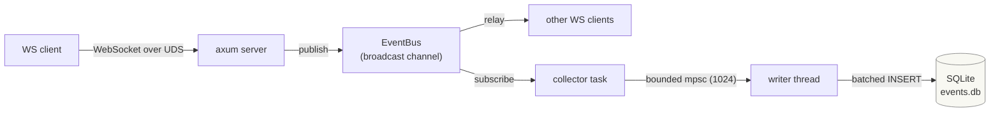
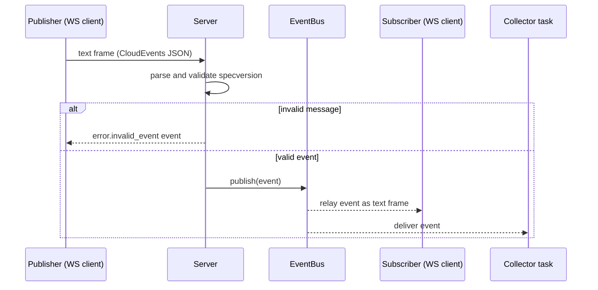
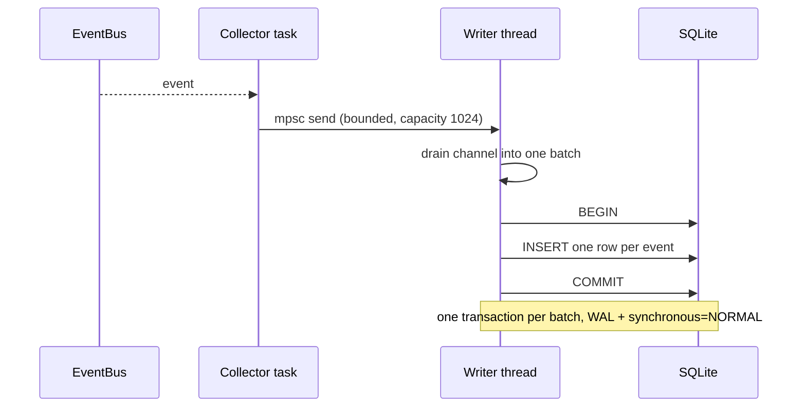
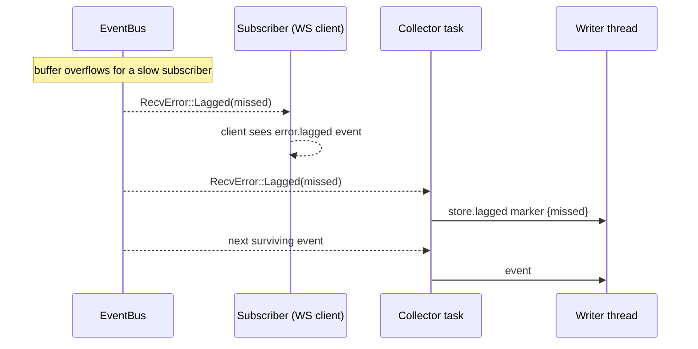
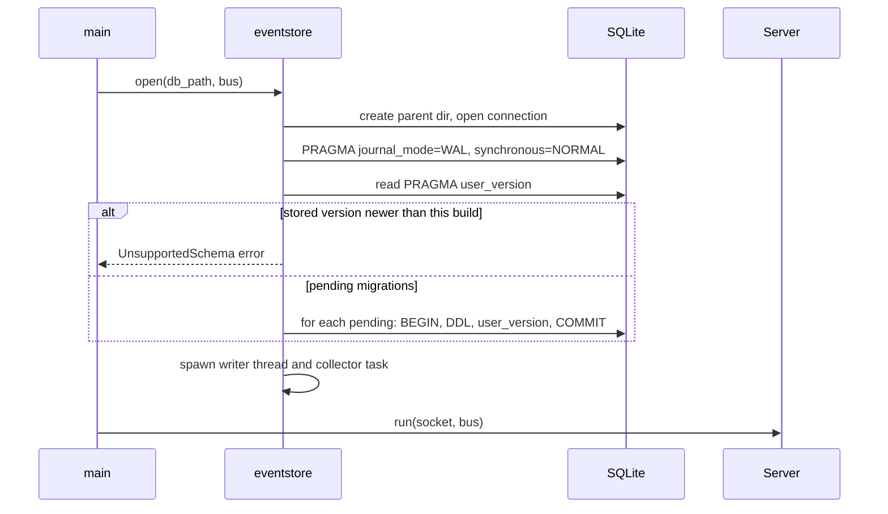

# agentd architecture

`agentd` is an always-on agent daemon. Components coordinate in a
choreography style: they publish events onto an in-process event bus and react
to the events published by others; there is no central orchestrator. Clients
connect over a WebSocket served on a Unix domain socket, and every event
flowing through the bus is persisted to a local SQLite event store as a
CloudEvents 1.0 envelope.

## Components



| Component          | Crate        | Role                                                                                                              |
| ------------------ | ------------ | ----------------------------------------------------------------------------------------------------------------- |
| Unix domain socket | `agentd`     | Transport and single-instance boundary; a stale socket file is removed, a live one reports `AlreadyRunning`.       |
| WebSocket endpoint | `agentd`     | Ingress and egress protocol. Inbound text frames must parse as CloudEvents; outbound events are forwarded verbatim. |
| `EventBus`         | `agentd-events` | In-process fanout to every subscriber via a `tokio::sync::broadcast` channel (capacity 1024 per subscriber).     |
| Collector + writer | `agentd`     | Event store workers: an async collector forwards events to a dedicated writer thread owning the SQLite connection. |
| SQLite store       | `agentd`     | Durable, append-only log of CloudEvents envelopes with a versioned, forward-only schema.                           |

## Event model

Every event on the bus and in the store is a CloudEvents 1.0 envelope:

| CloudEvents attribute | Rust field | Value / format                                              |
| --------------------- | ---------- | ----------------------------------------------------------- |
| `id`                  | `id`       | UUID version 7, so IDs order by creation time                |
| `source`              | `source`   | `urn:mokmokd` for daemon-produced events                     |
| `specversion`         | `specversion` | `1.0`, validated on ingress                               |
| `type`                | `kind`     | dotted kind, e.g. `error.lagged`, `store.lagged`             |
| `time`                | `time`     | RFC 3339 UTC; optional per the specification                 |
| `data`                | `data`     | Arbitrary JSON payload                                       |

```json
{
  "id": "0199b7ea-8f4a-7d12-9c3a-2f8b1e4d6a90",
  "source": "urn:mokmokd",
  "specversion": "1.0",
  "type": "test.event",
  "time": "2026-09-13T12:00:00.123456Z",
  "data": { "value": 1 }
}
```

## Sequences

### Publishing and relaying an event



### Persisting an event



The writer thread owns the SQLite connection; no async task touches SQLite
directly. If a batch fails, persistence stops permanently (logged at error
level) and the daemon keeps running — the store is best-effort, matching the
bus semantics.

### Backpressure and lag



Lag is how the bus applies backpressure: a subscriber that cannot keep up
loses events and observes a `Lagged(n)` error before the stream resumes. The
store records those gaps as `store.lagged` marker events so the log describes
its own holes. The bounded mpsc between collector and writer means a stalled
writer backpressures the collector into lagging on the bus instead of growing
memory without bound.

### Startup and migration



## Schema and migration strategy

The store keeps the full CloudEvents envelope verbatim next to the stable
core attributes denormalized into columns. Storing the envelope verbatim keeps
the schema stable when CloudEvents extension attributes appear; the
denormalized columns keep the log queryable for the attributes that matter.

```sql
CREATE TABLE events (
    seq         INTEGER PRIMARY KEY,
    id          TEXT    NOT NULL,
    source      TEXT    NOT NULL,
    specversion TEXT    NOT NULL,
    type        TEXT    NOT NULL,
    time        TEXT,
    event       TEXT    NOT NULL
) STRICT;
```

Schema changes use a hand-rolled, forward-only migration list
(`MIGRATIONS` in `agentd/src/eventstore.rs`) with the schema version recorded
in `PRAGMA user_version`:

- Migrations are appended, never rewritten; shipped entries are immutable.
- At startup every pending migration runs in its own transaction that also
  bumps `user_version`, so a crashed migration leaves the previous version
  intact and is retried on the next start.
- There are no down migrations: the store is append-only.
- A database written by a newer build is rejected with `UnsupportedSchema`
  instead of being read with a partially known schema.

Future schema changes therefore follow one recipe: append a new `(version,
sql)` entry to `MIGRATIONS` describing the change (e.g. an index for the first
read path), and keep the insert path consistent with the new schema.

## Extension model

There are two distinct ways to extend the daemon, and they have different
contracts:

| Axis                       | Contract                                                        | Ships as                                                                                     | Examples                          |
| -------------------------- | --------------------------------------------------------------- | -------------------------------------------------------------------------------------------- | --------------------------------- |
| In-process integration     | `Event`/`EventBus` from the `agentd-events` crate                | A workspace crate under `integrations/<name>`, wired into `agentd` behind a cargo feature     | Projections, webhook forwarding   |
| Out-of-process integration | CloudEvents 1.0 JSON over the WebSocket event API (Unix socket)  | Any external program in any language; no crate required                                       | Other stores, external tooling    |

The current structure follows three rules:

- `agentd-events` holds the event contract (`Event`, `EventBus`,
  `SPEC_VERSION`, `DAEMON_SOURCE`) and nothing else. Integrations depend on
  this crate and must never depend on the `agentd` binary crate.
- The SQLite event store is core: it lives inside `agentd`, attaches to the
  bus on every start, and is never feature-gated.
- Future optional integrations are compiled in behind bin features, e.g.
  `webhook = ["dep:agentd-integration-webhook"]`; the event store is excluded
  from gating by design.

The next structural steps have explicit triggers and are not taken early:

1. A second in-process integration starts implementation: create
   `integrations/<name>` and, only then, design any shared delivery
   abstraction (e.g. a `Subscriber` trait) from the two real implementations.
2. An external Rust consumer of the contract appears: start versioning and
   publishing `agentd-events`.
3. Out-of-process consumers want convenience: add a thin client crate; the
   wire format itself is already stable.

Adding workspace members requires no build-infrastructure changes: crane
discovers members from the workspace manifest, and CI runs clippy with
`--all-features` and tests over the whole workspace.
