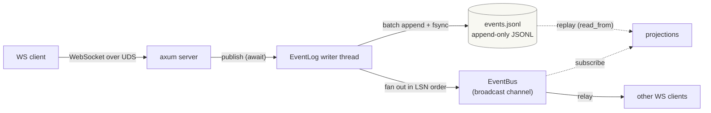
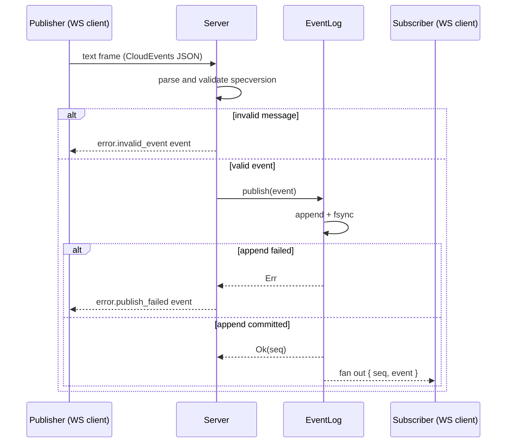
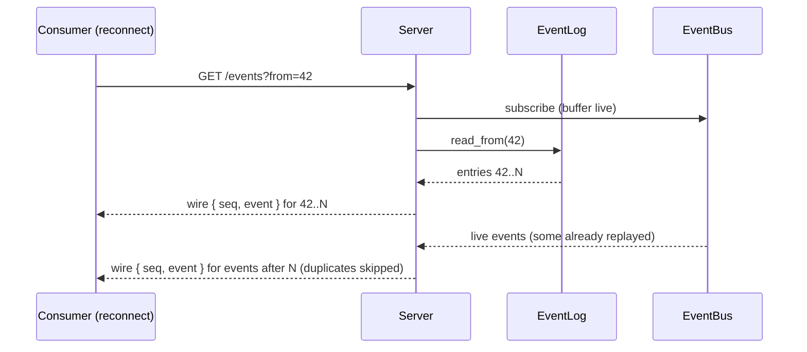
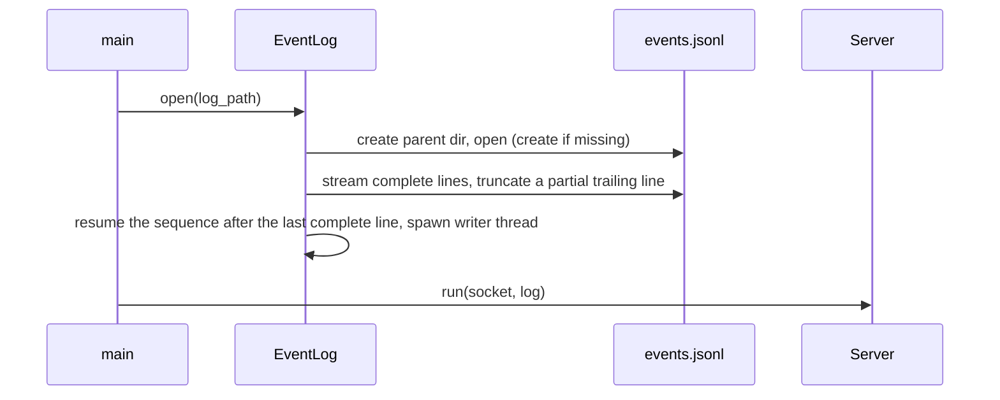

# agentd architecture

`agentd` is an always-on agent daemon. Components coordinate in a
choreography style: they publish events onto an in-process event bus and react
to the events published by others; there is no central orchestrator. Clients
connect over a WebSocket served on a Unix domain socket.

Every event is written to a durable append-only JSONL log **before** it is
fanned out, so the log is the source of truth and a live subscriber can never
see an event that is not already durable. Read models are rebuilt from the log
rather than from a second source of truth. Every event that leaves the log
carries its one-based position (`Seq`) alongside it, so a consumer can record
how far it has processed and resume from there.

## Components



| Component          | Crate           | Role                                                                                                              |
| ------------------ | --------------- | ----------------------------------------------------------------------------------------------------------------- |
| Unix domain socket | `agentd`        | Transport and single-instance boundary; a stale socket file is removed, a live one reports `AlreadyRunning`.       |
| WebSocket endpoint | `agentd`        | Ingress and egress protocol. Inbound text frames must parse as CloudEvents; outbound messages pair the event with its `seq` (see [Wire envelope](#wire-envelope)) and support `?from=` to resume. |
| `EventBus`         | `agentd-events` | Internal live fanout to subscribers via a `tokio::sync::broadcast` channel (capacity 1024 per subscriber); only `EventLog` publishes to it. |
| `EventLog`         | `agentd-events` | Durable write path: owns the writer thread, the log sequence number, the JSONL file, and the live fanout.           |
| JSONL log          | `agentd-events` | Append-only source of truth; one CloudEvents envelope per line, position = one-based line number (`Seq`).          |
| Projections        | `agentd-events` | Read models derived from the log, resuming from an `applied_seq` checkpoint (`agentd_events::projection`).          |

## Event model

Every event on the bus and in the log is a CloudEvents 1.0 envelope:

| CloudEvents attribute | Rust field    | Value / format                                              |
| --------------------- | ------------- | ----------------------------------------------------------- |
| `id`                  | `id`          | UUID version 7, so IDs order by creation time                |
| `source`              | `source`      | `urn:mokmokd` for daemon-produced events                     |
| `specversion`         | `specversion` | `1.0`, validated on ingress                                  |
| `type`                | `kind`        | dotted kind, e.g. `error.lagged`, `error.publish_failed`     |
| `time`                | `time`        | RFC 3339 UTC; optional per the specification                 |
| `data`                | `data`        | Arbitrary JSON payload                                       |

```json
{
  "id": "0199b7ea-8f4a-7d12-9c3a-2f8b1e4d6a90",
  "source": "urn:mokmokd",
  "specversion": "1.0",
  "type": "test.event",
  "time": "2026-09-13T12:00:00.123456Z",
  "data": { "value": 1 }
}
```

### Wire envelope

Outbound WebSocket messages pair the event with its position:

```json
{
  "seq": 42,
  "event": {
    "id": "0199b7ea-8f4a-7d12-9c3a-2f8b1e4d6a90",
    "source": "urn:mokmokd",
    "specversion": "1.0",
    "type": "test.event",
    "time": "2026-09-13T12:00:00.123456Z",
    "data": { "value": 1 }
  }
}
```

`seq` is the one-based log position, or `null` for a transient daemon notice
that is not part of the log (for example `error.lagged`). The position is
transport metadata and is never written into the JSONL log, whose lines remain
plain CloudEvents. Inbound frames are a bare CloudEvent; the daemon assigns the
position on append.

A consumer's saved position (its cursor) must only advance on a message whose
`seq` is non-null; notices carry `null` and must not overwrite it.

## Sequences

### Publishing and relaying an event



### Durable append (group commit)

```mermaid
sequenceDiagram
    participant S as Server
    participant Q as writer queue (bounded)
    participant W as Writer thread
    participant D as events.jsonl

    S->>Q: publish(event) (awaits an ack)
    W->>Q: drain the queue into one batch
    W->>D: write one JSON line per event
    W->>D: fsync once for the whole batch
    W->>W: fan out in LSN order, then ack each publish
    Note over W,D: one write and one fsync per batch; concurrent publishers share the fsync
```

The writer thread owns the file and the sequence number, so the log order is
the delivery order. `publish` returns only after the append has been synced;
events that cannot be synced are reported as errors instead of being silently
dropped.

### Backpressure and lag

The writer queue is bounded, so a slow disk backpressures publishers rather
than growing memory or losing events. Live subscribers are ordinary broadcast
subscribers: a subscriber that cannot keep up loses its live stream and
observes an `error.lagged` event, but the log is unaffected because it was
written before the fanout.

### Resuming from a position

A consumer persists the last `seq` it applied and reconnects with
`GET /events?from=<seq>` (inclusive). The server subscribes to the live bus
first, replays history from `from` to the end of the log, then continues live,
skipping any event it already sent:



If the live buffer overflows during a long replay, the server re-reads the
durable tail from the last sent position instead of dropping events, so a
resumed consumer never silently skips a position. A position outside
`1..=tail+1` (with `tail` the last committed position) is answered with an
`error.resume_out_of_range` notice and the connection is closed; a replay
failure likewise closes after an `error.replay_failed` notice, because
continuing would leave a permanent gap. Without `from`, a consumer is live-only
and a lag is reported as `error.lagged`, as before.

### Startup and recovery



## Log format and recovery strategy

The log is newline-delimited JSON. Each line is the verbatim CloudEvents
envelope, so the schema is stable when extension attributes appear and the log
stays consumable by ordinary tooling (`jq`, `rg`, DuckDB). There is no
migration list: attributes are read on demand.

- The position of a line is its one-based line number, exposed as `Seq`.
- A crash mid-append can leave a partial trailing line; recovery truncates it
  and keeps every complete line, so the log always ends on a line boundary.
- The log is at-least-once across a writer failure: an event that was written
  but not acknowledged may survive, so a retrying publisher can append it
  twice. Consumers deduplicate by `Event::id`.
- Positions are not stored in the file; they are derived from line numbers and
  attached as `agentd_events::LogEntry` on the live bus and the WebSocket API,
  so the file stays a plain CloudEvents stream. A consumer resumes by passing
  the last position it applied to `GET /events?from=`.
- History queries read the log directly (DuckDB over the JSONL, or `rg`);
  stateful read models replay it through `projection::catch_up`, which resumes
  from the projection's `applied_seq`.

## Extension model

There are two distinct ways to extend the daemon, and they have different
contracts:

| Axis                       | Contract                                                        | Ships as                                                                                     | Examples                          |
| -------------------------- | --------------------------------------------------------------- | -------------------------------------------------------------------------------------------- | --------------------------------- |
| In-process integration     | `Event`/`EventLog` from the `agentd-events` crate                | A workspace crate under `integrations/<name>`, wired into `agentd` behind a cargo feature     | Projections, webhook forwarding   |
| Out-of-process integration | CloudEvents 1.0 JSON over the WebSocket event API (Unix socket)  | Any external program in any language; no crate required                                       | Other stores, external tooling    |

The current structure follows these rules:

- `agentd-events` holds the event contract (`Event`, `SPEC_VERSION`,
  `DAEMON_SOURCE`), the live fanout (`EventBus`), and the durable log
  (`EventLog`) with its projection helpers. Integrations depend on this crate
  and must never depend on the `agentd` binary crate.
- The durable JSONL event log is core: it lives in `agentd-events`, is the
  source of truth, and is never feature-gated.
- Future optional integrations are compiled in behind bin features, e.g.
  `webhook = ["dep:agentd-integration-webhook"]`; the event log is excluded
  from gating by design.
- Integrations document their deviations from their design docs next to the
  code that embodies them, so a reader never has to reconcile two sources of
  truth from memory.

`agentd-integration-sandbox` (see `docs/sandbox.md`) is the second in-process
integration. It follows the dependency model — its own crate under
`integrations/sandbox`, depending only on `agentd-events`, wired into `agentd`
behind `sandbox = ["dep:agentd-integration-sandbox"]` — and it holds an
`EventLog`, durably appending `sandbox.permission.*` and
`sandbox.exec.completed` for every decision, so approval flows are ordinary
subscribers and no decision is lost. `Sandbox::exec` returns a `Result` and
surfaces `SandboxError::Publish` when an append fails; the decision is appended
before a command runs, so a command never starts without its decision recorded.
Its layer-1 executor is macOS-only so far
(Seatbelt; Linux Landlock/seccomp is a follow-up), spawned-command reads are
not path-confined on macOS 26 (dyld aborts on filtered read grants — a stated
gap recorded in the crate docs), and no component drives the sandbox yet, so
the feature exists to validate the dependency graph under CI's
`--all-features`.

Further structural steps keep explicit triggers and are not taken early:

1. An external Rust consumer of the contract appears: start versioning and
   publishing `agentd-events`.
2. Out-of-process consumers want convenience: add a thin client crate; the
   wire format itself is already stable.

Adding workspace members requires no build-infrastructure changes: crane
discovers members from the workspace manifest, and CI runs clippy with
`--all-features` and tests over the whole workspace.