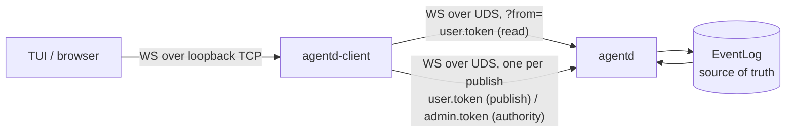

# agentd client server design

The daemon already holds everything a client-driven architecture needs: the
`EventLog` (the source of truth) and its `EventBus` fanout, the `Sandbox`, and
the `SessionManager`. Both things a client does are already messages — a prompt
is a `publish` under the `publish` claim, and a decision is a `publish` under
the `authority` claim.

The one thing missing is reach: the daemon listens on a Unix domain socket only,
on the two routes `/events` and `/inference`
(`agentd/src/server.rs:182-184`), and the repo's only `TcpListener` is the
CONNECT proxy's egress leg. A TUI or a browser cannot connect.

The **client server** (`agentd-client`) closes that gap out of process. The nouns
are fixed in [vocabulary](vocabulary.md).

## Boundary

The client server is an actor in the existing sense: it speaks `CloudEvents` and
authenticates as a peer, so it needs no `Bridge` (see
[session](session.md#relationship-to-the-existing-session-manager)). It adds a
transport, not a protocol.

Both directions carry the daemon's shapes verbatim: a `WireEnvelope` downlink and
a bare `Event` uplink. The client server is **stateless** — no database, no
journal, no read model — so a restart costs nothing but a replay.

## What is deleted first

Step 2 of the design process, before the code:

- **No read model, and so no conversation index.** A UI already knows which
  conversation it is displaying, so the prompt carries `conversation_id`
  explicitly and the server resolves nothing. This also deletes the whole
  question of persisting an index: there is nothing to persist.
- **No daemon change.** `serve` and `up` are untouched; the daemon's listen
  surface does not grow.
- **No browser-held token.** The UI never sees a bearer secret.
- **No new event types on the log.** The uplink reuses `agent.*` and the
  decision families; the notices below never reach the daemon.
- **No static asset pipeline in v1.** The transport is the deliverable; the UI
  arrives later on the same socket.

## The downstream protocol

- **Downlink**: a verbatim `WireEnvelope` (`{"seq": n, "event": {...}}`),
  including the daemon's transient notices (`seq: null`), such as
  `daemon.caught_up` and `error.lagged`. A client must not advance its
  checkpoint on a `null` seq.
- **Uplink**: a bare `Event` JSON, exactly what the daemon accepts on `/events`,
  with a client-chosen `id` (a UUID).
- **Local notices**, never published to the daemon and never written to the log:

| Type | Data | When |
| --- | --- | --- |
| `client.publish_committed` | `event_id`, `seq` | the daemon committed the event |
| `client.publish_failed` | `event_id`, `error` | refused locally, rejected, or unresolved |
| `client.upstream_lost` | `error` | the daemon connection ended; the socket then closes |

`event_id` is `null` in `client.publish_failed` when the frame could not be
parsed, so the client has no id to correlate with. These are downstream-only
transport notices in the same sense as `daemon.caught_up`; they are recorded in
[vocabulary](vocabulary.md#event-types).

## Connections

- **One daemon read connection per downstream client**, opened with the client's
  own `?from=` unchanged. The daemon's replay and backpressure therefore serve
  each client directly and the client server buffers nothing. A connection is
  retried with backoff (100 ms doubling to 5 s) for a bounded number of attempts,
  so a client that arrives while the daemon is starting still connects.
- **One daemon connection per publish**, opened with the user or admin token and
  dropped after the verdict. This is deliberately not a shared long-lived
  connection: a connection that stays subscribed but is not read accumulates live
  events and eventually receives `error.lagged`, which `WsClient::publish` would
  read as a rejection of the next event. The rate is human prompts and decisions,
  so the handshake cost is irrelevant.

## Routing and access control

`is_reserved_type` decides the route, and only the three decision families may
cross to the authority connection:

| Uplink event | Route |
| --- | --- |
| non-reserved (`agent.*`) | user connection (`read`, `publish`) |
| `sandbox.permission.*`, `session.permission.*`, `session.egress.*` | authority connection (`admin.token`) |
| any other reserved type (`error.*`, `daemon.*`, `session.started`, `sandbox.exec.completed`, …) | refused locally |

A refusal is answered with `client.publish_failed` and the daemon is never
contacted, so a downstream client cannot ask the client server to forge a
reserved event. Approvals are additionally opt-in: without `--allow-approve`,
every reserved type is refused.

The downstream socket binds **loopback only**; a non-loopback `--bind` is a
startup error. There is no downstream authentication in v1, so a network bind
would expose publishing to anyone who can reach the port. A remote bind and its
authentication are a later increment.

The `admin.token` is read only when approvals are enabled and never leaves the
client server.

## Retry and idempotency

The log is the retry mechanism; the client server holds no state across a
restart. The UI must:

1. generate `Event::id` (UUIDv7) **before** sending a prompt, and persist it as
   pending alongside its own `?from=` checkpoint;
2. on reconnect, replay from its checkpoint: an event whose `id` is pending means
   the prompt committed — clear it, do not resend;
3. treat `client.publish_failed` as a definite rejection — discard the id;
4. a pending id not observed after `daemon.caught_up` was never committed —
   resend with the **same** id.

This is complete because the daemon validates but does not deduplicate the id,
and every committed event returns on the client's own read connection. No
`agentd-node` change is required.

Within one run the client server also remembers each publish's terminal verdict
by id, so a resend is answered from the reminder rather than appended twice even
when the UI skips rule 2. That map does not survive a restart; rule 2 is what
covers the restart.

## Placement

`agentd-client` is a workspace member, not a binary inside `agentd-node`.
`agentd-node` runs confined and needs only the client side of the wire, so adding
a server framework to it would pull `axum` into the sandboxed node for no reason.
The new crate depends on `agentd-events`, `agentd-node` (for `WsClient` and
`PublishError`), `agentd-telemetry`, and `axum`. Adding a workspace member needs
no build-infrastructure change (see
[architecture](architecture.md#extension-model)).

## Stated gaps

- **The verdict map is unbounded.** It grows with the number of publishes in a
  run. Prompts and decisions are human-rate, so this is small today; a bound is
  a follow-up if the map ever matters.
- **No downstream authentication, and loopback only.** Anything that can reach
  the loopback port can publish as the user, and approve when approvals are on.
- **`error.lagged` on a publish connection is read as a rejection.** The window
  is one round trip (connect to publish) and cannot overflow the daemon's
  1024-event subscriber buffer in practice, but it is not structurally excluded.
- **No UI.** v1 is the transport; the TUI/Web client is the next increment, and
  the retry rules above are its contract.

## Testing

`agentd-client/tests/relay.rs` runs a real daemon router on a Unix socket, the
client server on a loopback port, and WebSocket clients:

- a prompt is relayed, committed, and echoed on the same connection with its
  position;
- a client resuming with `?from=1` receives the replayed event;
- a reserved type is refused without approvals and never appended;
- a decision with approvals enabled reaches the log with the authority token's
  provenance;
- a retried id is answered from the verdict map and appended only once.

`policy.rs` unit-tests the route table, and `relay.rs` also covers the
non-loopback bind refusal.

## Open questions

- Whether the deferred `process-compose` orchestration is now triggered: the
  client server is the second resident component its deferral waited for (see
  [reconciliation](reconciliation.md)).
- Whether the wire client (`WsClient`, `PublishError`) moves into a
  `agentd-sandbox`-free shared crate, so `agentd-client` does not build
  `rusqlite` through `agentd-node`.
- What the downstream authentication is when the UI is no longer on the same
  host.
