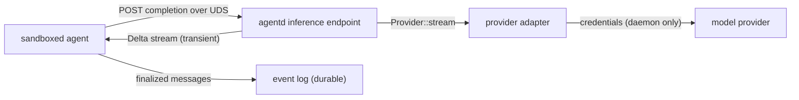

# agentd inference design

The sandbox denies network egress outright, so a confined agent cannot reach a
model provider directly. Inference is therefore a **daemon capability**: the
daemon holds the provider credentials and performs the request on the agent's
behalf, and the agent reaches it over the daemon's own Unix socket — the one
endpoint its policy grants (see [sandbox](sandbox.md) and
[architecture](architecture.md)). This document is the contract for that
boundary.

## Goals and non-goals

Goals:

- A sandboxed node can request a completion without any network egress and
  without holding provider credentials.
- Multiple providers and models are reachable through one boundary, and a model
  can be swapped by configuration rather than by changing the agent.
- The provider is swappable behind a trait, so the agent loop can be tested with
  a deterministic fake and a real provider is a thin adapter.
- The volatile token stream never bloats or leaks into the durable audit log;
  only finalized messages become events.

Non-goals:

- **No provider credentials in the sandbox.** The agent's token only grants the
  daemon's inference endpoint; it never sees an API key.
- **No non-daemon remote services.** A directly reached service would need the
  managed-proxy model as a separate opt-in layer (see `docs/sandbox.md`).
- **No inference event log.** Requests and deltas are transient; an
  `inference.*` event family is not reserved or emitted in this version.

## The boundary

Inference is a second WebSocket route on the **same** Unix socket as the event
API, so no policy change is needed and egress stays denied.



| Piece                    | Crate               | Role                                                                 |
| ------------------------ | ------------------- | -------------------------------------------------------------------- |
| Wire contract            | `agentd-inference`  | `Message`, `ToolSpec`, `InferenceRequest`, `Delta`                   |
| `Provider` trait         | `agentd-inference`  | Starts a `Delta` stream for a request; provider-neutral               |
| `FakeProvider`           | `agentd-inference`  | Replays scripted deltas for tests and offline development             |
| `InferenceClient`        | `agentd-inference`  | Node-side client for `/inference`                                     |
| `/inference` endpoint    | `agentd`            | Authenticated endpoint that streams a provider response               |

## Wire contract

A client opens `/inference`, sends one `InferenceRequest` as a text frame, and
reads `Delta` text frames until a terminal delta. The connection stays open for
the next request.

```json
{"messages":[{"role":"system","content":"..."},{"role":"user","content":"..."}],
 "tools":[{"name":"shell","description":"...","parameters":{"type":"object"}}]}
```

The response is one JSON object per frame:

```json
{"type":"text","text":"I will run "}
{"type":"tool_call","id":"call-1","name":"shell","arguments":"{\"command\":\"ls\"}"}
{"type":"done","finish_reason":"tool_calls"}
```

A model-side failure is a terminal `{"type":"error","message":"..."}` delta, not
a transport error, so the agent decides how to record it. A malformed request is
answered with an error delta and the connection stays open.

The shapes mirror the streaming completion protocol most providers expose, so a
provider adapter is mostly a field mapping. `arguments` is kept as the
provider's JSON string, so the contract does not depend on a tool's schema.
Streamed tool-call fragments are reassembled by the adapter and emitted as
complete `tool_call` deltas before the terminal one.

## Providers and model routing

The daemon is the gateway: it holds the providers and their credentials, and it
resolves the `model` a request names. Real adapters live in `agentd-inference`
behind the optional `providers` feature, so a node (which only needs the wire
contract and the client) never pulls an HTTP client or TLS.

| `kind`               | Covers                                                            |
| -------------------- | ----------------------------------------------------------------- |
| `open_ai_compatible` | `OpenAI`, `OpenRouter`, `Ollama`, `vLLM`, `Groq`, and compatible servers |
| `anthropic`          | Claude (`/v1/messages`, tool-use blocks)                          |

A provider is configured with a kind, an optional base URL (a kind default is
used otherwise), and a credential. Credentials come from a private file (mode
`0600`, as for the event token) or an environment variable — never inline. A
local server names neither and is reached unauthenticated.

```json
{
  "providers": {
    "openrouter": {
      "kind": "open_ai_compatible",
      "base_url": "https://openrouter.ai/api/v1",
      "api_key_env": "OPENROUTER_API_KEY"
    },
    "anthropic": {
      "kind": "anthropic",
      "api_key_file": "/etc/agentd/anthropic.key"
    },
    "local": {
      "kind": "open_ai_compatible",
      "base_url": "http://127.0.0.1:11434/v1"
    }
  },
  "models": {
    "fast": { "provider": "openrouter", "model": "openai/gpt-4o-mini" },
    "smart": { "provider": "anthropic", "model": "claude-sonnet-4-5" }
  },
  "default_model": "fast"
}
```

A request's `model` is resolved in order: a configured **alias**; a
`provider/model` pair split on the first slash; the **sole** provider with the
name unchanged; and, when the request names none, `default_model`. An
unresolvable model is a `Delta::Error`. The agent asks for an alias
(`agentd-agent --model smart`) and never learns a provider id or a credential.

The daemon loads `--providers-config <path>` if given, otherwise
`$XDG_CONFIG_HOME/agentd/providers.json` (`~/.config/agentd/providers.json`) when
it exists; with neither it serves the deterministic `FakeProvider` used by tests
and offline development.

## Durability line

| Data                            | Where                | Why                                       |
| ------------------------------- | -------------------- | ----------------------------------------- |
| Request, text/tool deltas       | transient            | high-frequency, large, may be sensitive    |
| Finalized assistant message     | `agent.message` event | the conversation is rebuildable from the log |
| Tool call                       | inside `agent.message` | the call and its reply are one turn      |
| Tool result                     | `agent.tool_result`  | the tool output is part of the record      |

The SQLite conversation projection is rebuilt by replaying the log, so anything
not an event would be lost on rebuild. Only the token stream is transient;
everything the model *decides* is durable.

## Access control

`/inference` requires the `infer` claim (see
[architecture](architecture.md#access-control)). A token without it is answered
with `403 Forbidden`; a missing or unknown token with `401 Unauthorized`. The
agent's token carries `read`, `publish`, and `infer`: it must subscribe to the
log, publish its `agent.*` events, and call inference, but it must **not** hold
`authority`, so it cannot forge `session.*` or `sandbox.*` events.

The provider credentials belong to the daemon and are never passed to the
sandbox. The token file rule (mode `0600`) applies as for any other capability.

## The agent events

The agent publishes these non-reserved `agent.*` types; they are ordinary
publishable events, not daemon-authority ones, because the agent is the author:

| Type                   | When                                              |
| ---------------------- | ------------------------------------------------- |
| `agent.inbox`          | A user prompt that starts a turn                  |
| `agent.message`        | A finalized assistant message (with any tool calls) |
| `agent.tool_result`    | The result of a tool the assistant called         |
| `agent.turn.started`   | A turn began                                      |
| `agent.turn.completed` | A turn completed without a provider error         |
| `agent.turn.failed`    | A turn failed (for example a provider error)      |

`agent.inbox` is the only trigger: an agent runs a turn when an inbox for its
conversation is applied. Every `agent.*` event is projected into the
conversation read model; other events advance the checkpoint unapplied.

## Stated gaps

- **The adapters are not yet exercised against live APIs.** They map the
  documented streaming shapes and are unit-tested, but a recorded-fixture or
  live test corpus is the follow-up; a provider-specific quirk may surface there.
- **Anthropic `max_tokens` is a fixed default.** The adapter sends 8192 because
  the API requires the field and the request does not carry one yet.
- **No provider timeout in the endpoint.** A provider that stalls holds the
  stream open; each adapter's HTTP client is expected to enforce its own
  request timeout.
- **No fallback or retry.** A failed model fails the turn; cross-provider
  fallback and retry are a later layer over the registry.
- **No token accounting.** The `done` delta may carry a finish reason but usage
  is not yet recorded, even though the adapters see it.
- **One request at a time per connection.** The connection is
  request/response; concurrent inference uses one connection each.
- **One turn at a time.** The agent runs a turn synchronously, so a prompt that
  arrives during a turn waits; concurrent conversations are separate agents.
- **A timed-out command may leave grandchildren.** The shell tool kills its
  direct child (`bash`) but not the process group, so a backgrounded grandchild
  can outlive the command. It stays confined by the session sandbox; the
  session manager reaps the session's group only when the session ends.
- **A turn is not resumable.** If the agent dies mid-turn, the messages
  finalized before the crash survive in the log, but the in-flight turn is lost.
  The conversation is not corrupted, and a new inbox starts a fresh turn.
