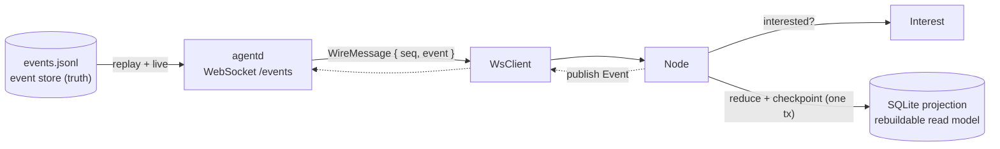

# agentd node design

A node is the client side of the choreography. It is a long-lived process that
subscribes to the daemon's event log over a WebSocket on a Unix domain socket,
decides which events it cares about, and keeps a SQLite projection in sync with
them. The eventual target is a **session** running inside a sandbox; the first
version is sandbox-agnostic so that constraint does not force a rewrite later.

## The store/projection split

Two layers, with a strict direction of truth:

| Layer                | Lives in       | Role                                                               | Disposable? |
| -------------------- | -------------- | ------------------------------------------------------------------ | ----------- |
| JSONL event log      | `agentd-events` | Append-only CloudEvents; the source of truth; never rewritten       | No          |
| SQLite projection    | `agentd-node`  | State derived by replaying the log; a read model with a checkpoint  | Yes         |

The SQLite file is **not** a write-ahead log and the JSONL log is **not** a
transient journal. A WAL is a database-internal, truncatable structure; the
JSONL log is the permanent event store. If the projection's schema or reducer
changes, delete the SQLite file and rebuild it from the log — the log is never
truncated or compacted in this design.

## Components

| Component          | Type                 | Role                                                                                   |
| ------------------ | -------------------- | -------------------------------------------------------------------------------------- |
| `WsClient`         | `agentd-node`        | Bidirectional WebSocket over a Unix domain socket; `?from=` resumes from a position.    |
| `Interest`         | `agentd-node`        | Client-side selection: whether an event should be applied.                              |
| `SqliteReducer`    | `agentd-node`        | The domain: the schema and how one event changes state.                                 |
| `SqliteProjection` | `agentd-node`        | Owns the connection, the checkpoint, and the transaction that keeps the two consistent. |
| `Node`             | `agentd-node`        | Connect, resume, select, apply, reconnect with backoff.                                 |



## Checkpoint and idempotency

The checkpoint is the position of the last event the node applied **or
skipped**. It is stored in the same SQLite database as the projection state and
is written in the **same transaction** as the reducer's change. A crash can
therefore never leave the checkpoint ahead of the state it describes, so a
restart never silently skips an event.

Delivery is at-least-once: an event written but not acknowledged may be appended
twice after a crash. The node guards against duplicates by position — an event
at or before the checkpoint is ignored — so replaying an overlapping range is a
no-op. Reducers should still be written to be idempotent per event where the
domain allows it.

```mermaid
sequenceDiagram
    participant N as Node
    participant S as agentd
    participant P as SQLite

    N->>P: read checkpoint (applied_seq)
    N->>S: GET /events?from=applied_seq+1
    S-->>N: replay applied_seq+1 .. tail
    S-->>N: live events
    loop each event
        alt interested
            N->>P: BEGIN; reduce; checkpoint; COMMIT
        else skipped
            N->>P: BEGIN; checkpoint; COMMIT
        end
    end
```

## Filtering

The daemon broadcasts every event to every subscriber. The node decides with an
`Interest`:

- `TypePrefixes::new(["sandbox."])` matches by `CloudEvents` `type` prefix; an
  empty set matches everything.
- Any `Fn(&Event) -> bool` is an `Interest`.

A filtered-out event still advances the checkpoint, so a restart does not
re-read it. The consequence is that **changing the filter does not retroactively
apply events that were skipped**; to reproject under a new filter, rebuild the
projection with `--rebuild`.

## Running a node

```sh
agentd-node \
  --socket ~/.agentd/agentd.sock \
  --db /path/to/session/node.db \
  --token-file /path/to/node.token \
  --source urn:mokmokd:session:1 \
  --type-prefix sandbox.
```

`--token-file` is a file whose contents are the bearer secret the daemon
expects; the node needs only the `read` claim unless it publishes. Keep the file
private to the node's user.

The bundled binary projects a count of events per `type` and exists to validate
the transport, checkpoint, and resume behaviour. A real session replaces the
reducer and the filter.

## Sandbox direction (planned, not implemented)

Nodes are intended to run inside the sandbox. The foundation is built so this
does not require rework:

- Everything external is a CLI argument (`--socket`, `--db`, `--source`); the
  node assumes no host paths and does not read the environment for config.
- The node communicates only through the event log; stdout and stderr carry
  diagnostics, not state.
- The node does not spawn subprocesses, so no `process-exec` grant is needed.
- SQLite writes its journal or WAL sidecar next to the database, so the whole
  **directory** must be writable, not just the file. Place the database in one
  sandbox session `write` entry per session.

The remaining work is on the daemon side and is tracked in `docs/sandbox.md`:

1. The session manager `agentd::session` (behind the `sandbox` feature) reacts to
   a `session.requested` event by launching a configured sandboxed node and
   reporting `session.*` lifecycle. The daemon binary does not start it yet, and
   it does not yet restart a crashed node.
2. The sandbox has a long-lived spawn API (`Sandbox::spawn` returning a
   `Session` with piped stdio).
3. The whole node process is confined by one profile; child processes inherit
   it, so per-command `sandbox.permission.*` events are not emitted.
4. The node's connection to the daemon is the one allowed network path: egress is
   denied outright, and the sandbox must explicitly permit the daemon's Unix
   socket (the macOS `network-outbound` requirement for a Unix socket is still
   unverified). The node needs no read of host files, and the database lives in
   its own session write entry, so the file-effect policy is otherwise unchanged.

## Stated gaps

- **Synchronous SQLite.** A reducer's transaction runs on the async task that
  receives the event, so a slow disk blocks that worker. There is one commit
  (and its `fsync`) per event. Batching commits and offloading them to a
  blocking worker are deliberate follow-ups, not done yet because the node's
  only work is this stream and correctness is easier to see with one event per
  transaction.
- **A projection ahead of the log is fatal.** If the daemon starts with a fresh
  log, the node's checkpoint can be beyond the tail. The daemon answers
  `error.resume_out_of_range` and the node stops with
  `NodeError::ResumeOutOfRange`; rebuild with `--rebuild` rather than silently
  resetting state.
- **Changing the filter does not reproject.** Events skipped under an earlier
  filter are not revisited; rebuild the projection to apply a new filter.

## Testing

- Unit: checkpoint persistence, idempotent re-apply, skip semantics, and
  `Projection::catch_up` over an `EventLog`.
- End-to-end (`agentd/tests/node_session.rs`): a real daemon, a node projecting
  into SQLite, a filtered-out event advancing the checkpoint, and a restart
  resuming from the checkpoint without replaying from zero or double-counting.