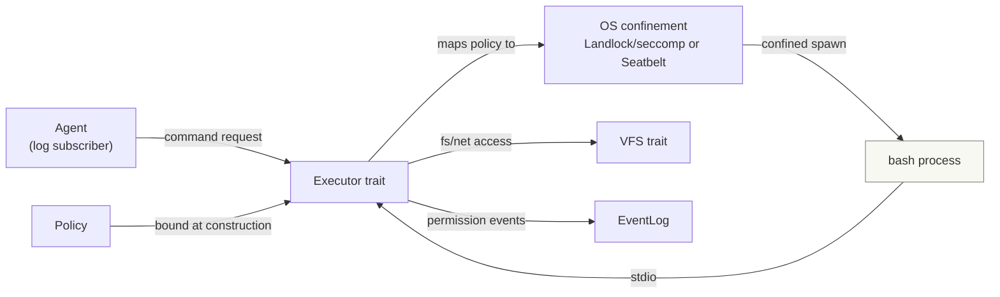
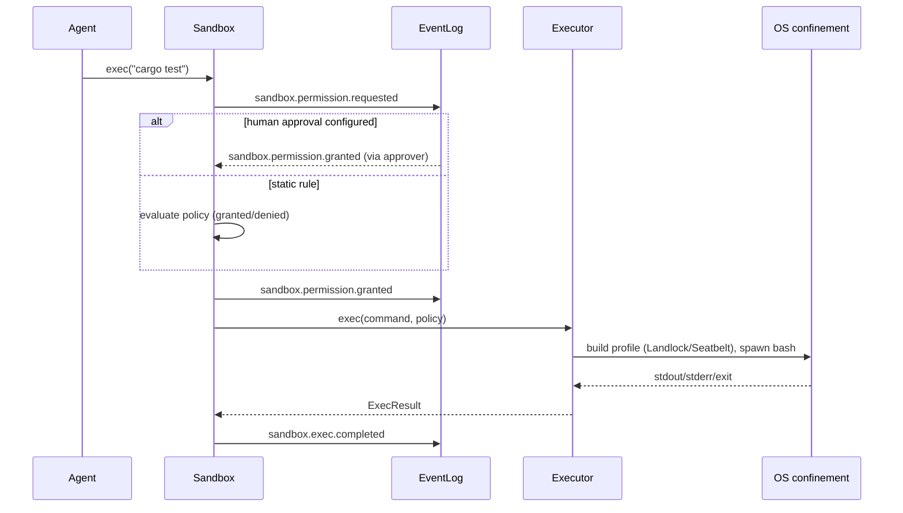

# agentd sandbox design

The sandbox is the confinement layer through which an agent drives shell
commands. Every command an agent requests runs against a virtual filesystem
and a policy that the daemon operator configures — never directly against the
host. Permission decisions are durably appended as CloudEvents to the event
log, so approval flows and audit trails are built from the same choreography
model as everything else in `agentd`.

The design borrows its conceptual model from
[goccy/sheena](https://github.com/goccy/sheena) — deny-by-default policy, a
single virtual resource plane shared by every execution path, and explicit
resource limits — adapted to Rust and to this project's event-driven
architecture.

## Goals and non-goals

Goals:

- An agent can run bash commands with filesystem and resource access confined by
  a `Policy`, and can reach remote services (its model provider above all).
- VFS and shell permissions are configurable per sandbox instance.
- Permission grants and denials are durable events in the log, enabling
  human-in-the-loop approval by any WS client.
- The execution strategy behind the shell is swappable.

Non-goals (stated honestly, per the Sheena precedent):

- No hard per-process memory ceiling on macOS (no cgroups equivalent); memory
  caps are best-effort there.
- The sandbox is not a boundary for hostile native code. It confines the tool
  calls an agent *requests* against a configured policy.
- **No confinement of network reachability.** A confined command may open any
  outbound connection. A coding agent must reach its inference provider, and a
  sandboxed node must reach the daemon over a Unix socket; confining
  reachability would break both, and the daemon has no client authentication, so
  reachability is not a boundary to begin with. Inbound connections (a listening
  socket) stay denied. What bounds an outbound connection is therefore the
  *read* side: see "Read confinement" below.
- **Cedar is not adopted.** A policy language was considered for the file-effect
  rules and dropped: the rules are a pair of path lists, and the layer-1 profile
  is rendered from them directly. Revisit only if policies must be authored
  outside the Rust code.

## Design principles

1. **Deny-by-default.** Nothing runs, no file is written, no listener is opened
   until the policy opts in. The zero value of a `Policy` is fully inert.
2. **Single virtual resource plane.** Shell commands, non-shell tools, and any
   future in-process execution all see the *same* VFS, the *same* limits, and
   the *same* file-effect policy. There is exactly one path to the filesystem.
3. **Swappable executors.** The shell execution strategy sits behind an
   `Executor` trait. Layer 1 maps the policy onto OS-level confinement
   (Landlock/seccomp on Linux, Seatbelt on macOS). A future layer 2 may add an
   in-process interpreter with re-implemented commands (the Sheena model)
   without changing the policy or event contract.
4. **Every decision is an event.** Each permission check produces a CloudEvent
   (`requested` → `granted`/`denied`) durably appended to the log, so the audit
   log is the log itself, and approval UIs are ordinary subscribers.
5. **Kernel-enforced over convention-enforced.** Path confinement that the OS
   itself guarantees (Landlock rulesets, Seatbelt profiles) is preferred over
   in-process path checks, which a confused-deputy command can bypass.

## Policy model

`Policy` has four domains. Its default is deny-everything:

| Domain    | What it controls                                                                 |
| --------- | -------------------------------------------------------------------------------- |
| `fs`      | VFS mounts: read-only, read-write, overlay; path deny/hide globs; layer-1 read denials; byte caps |
| `shell`   | Allowed command prefixes, environment allowlist, working directory, login shells |
| `network` | Nothing configurable; outbound is open, inbound denied                           |
| `limits`  | Wall-clock timeout, command count, output bytes, best-effort memory cap          |

```rust
pub struct Policy {
    pub fs: FsPolicy,
    pub shell: ShellPolicy,
    pub network: NetworkPolicy,
    pub limits: Limits,
}

pub struct FsPolicy {
    pub mounts: Vec<Mount>,        // ReadOnly / ReadWrite / Overlay over a host dir, or Mem
    pub refuse: Vec<Pattern>,      // access denied (e.g. ".env", "*.pem", ".git/**")
    pub hide: Vec<Pattern>,        // paths appear absent, including in listings
    pub deny_read: Vec<PathBuf>,   // host paths the OS profile withholds (absolute; not globs)
    pub max_total_bytes: Option<u64>,
    pub max_file_bytes: Option<u64>,
}

pub struct ShellPolicy {
    pub allow: Vec<CommandPrefix>, // deny-by-default; empty means no command runs
    pub env: EnvAllowlist,         // the host environ is never inherited
    pub workdir: PathBuf,
}

pub struct Limits {
    pub timeout: Duration,
    pub max_command_count: u32,   // fork-bomb / runaway loop guard
    pub max_output_bytes: u64,
    pub max_memory_bytes: Option<u64>, // enforced via rlimit/cgroups where available
}
```

`refuse`/`hide` and `deny_read` are different mechanisms and both are needed.
The globs screen *virtual* paths at the VFS layer, so they shape what the agent's
tool calls see. Layer 1 spawns real host binaries, which never touch the VFS, so
a glob cannot withhold anything from them — `deny_read` is rendered into the OS
profile instead. A path that must not leak to a spawned command belongs in
`deny_read`; a path the agent should not even see belongs in `refuse`/`hide`.

Network has no configurable surface. Outbound connections are allowed and
inbound ones are denied at the OS level; per-host rules and an SSRF guard are
not implemented, and are not planned while reachability stays a non-goal.

### Read confinement

Reads are granted broadly on purpose and then narrowed:

- **Broad grant.** On macOS 26 a filtered read grant makes platform binaries
  abort inside `dyld4::CacheFinder`, measured as a `SIGABRT` before the shell
  even starts. Narrowing the grant to system directories does not work, so the
  profile grants reads at `/`.
- **Explicit denial.** Seatbelt evaluates a deny ahead of any matching allow, so
  `FsPolicy::deny_read` entries are emitted as denials after the broad grants.
  Data, metadata, and extended attributes are all denied, because withholding
  the contents alone would still expose names and sizes through `stat`. This
  *does* hold against a spawned host binary, and is verified by tests that read
  and stat a secret file through a real process.
- **Entries are validated.** An entry must be an absolute host path that
  resolves, and must not cover the workdir, an executable directory, or the
  sandbox scratch directory. A failure at any of these is an
  `InvalidPolicy` error at construction, not a silently-ignored entry: dropping
  a denial would leave a weaker sandbox than the operator configured, which is
  the opposite of dropping a write *grant* (where the sandbox merely narrows).
  `~` is a shell expansion and is *not* performed on a path, so entries must be
  written out absolutely.
- **Canonicalisation is required.** The profile matches resolved paths, so
  `/tmp` is `/private/tmp`. Both the denials and the protected paths they are
  checked against are resolved before comparison.

With no `deny_read` entries, reads stay entirely unconfined at the OS level and
only the VFS screens them — the stated gap below. The default is empty because
only the operator knows what their host considers secret.

## Architecture

The sandbox ships as a new workspace crate, `agentd-integration-sandbox`
(implemented under `integrations/sandbox`), following the documented
in-process extension model: it depends on `agentd-events` only and is wired
into `agentd` behind a cargo feature (`sandbox = ["dep:agentd-integration-sandbox"]`).



| Component                 | Crate                        | Role                                                                                      |
| ------------------------- | ---------------------------- | ----------------------------------------------------------------------------------------- |
| `Policy`                  | `agentd-integration-sandbox` | The four-domain deny-by-default configuration; serializable so it can arrive as an event. |
| VFS                       | `agentd-integration-sandbox` | `Vfs` trait with `Mem`, `ReadOnlyMount`, `ReadWriteMount`, `Overlay` implementations.      |
| `Executor` trait          | `agentd-integration-sandbox` | Runs a command string under a policy; returns `Result { stdout, stderr, exit_code }`.      |
| `ConfinedProcessExecutor` | `agentd-integration-sandbox` | Layer 1: translates policy into an OS confinement profile and spawns a real bash.          |
| Permission publisher      | `agentd-integration-sandbox` | Emits `sandbox.permission.*` CloudEvents for every policy evaluation.                      |

### VFS trait

The VFS is the shared plane. Its read surface is intentionally narrow, and
path confinement (normalization, `..` clamping, symlink escape prevention) is
applied uniformly at this layer even though layer 1 also enforces it in the
kernel — defense in depth, and the trait is the only path for future
in-process executors that have no kernel boundary.

```rust
pub trait Vfs: Send + Sync {
    fn read(&self, path: &VPath) -> io::Result<Vec<u8>>;
    fn read_dir(&self, path: &VPath) -> io::Result<Vec<DirEntry>>;
    fn stat(&self, path: &VPath) -> io::Result<Metadata>;
    fn write(&self, path: &VPath, data: &[u8]) -> io::Result<()>;
    fn mkdir(&self, path: &VPath) -> io::Result<()>;
    fn remove(&self, path: &VPath) -> io::Result<()>;
    fn rename(&self, from: &VPath, to: &VPath) -> io::Result<()>;
}
```

- `Mem`: fully in-memory, byte-accounted; the default and the safest mount.
- `ReadOnlyMount` / `ReadWriteMount`: a host directory, confined. `ReadWriteMount`
  mounts are additionally handed to the OS confinement layer so the kernel
  rejects writes outside the mount even if a spawned command escapes path
  checks.
- `Overlay`: copy-on-write; reads fall through to the host layer, writes stay
  in memory. The default for coding-agent workspaces: the agent can "modify"
  the repo without contaminating it until a commit step materializes the diff.

`Refuse`/`Hide` globs are evaluated inside every implementation, so a `.pem`
denied in one mount is denied through every consumer of that mount.

### Executor trait and layer 1

```rust
pub trait Executor: Send + Sync {
    /// The policy is bound at executor construction, not per call, so a
    /// running executor cannot widen its own permissions.
    async fn exec(&self, command: &str) -> ExecResult;
}

pub struct ExecResult {
    pub stdout: String,
    pub stderr: String,
    pub exit_code: i32,
    pub denied_by: Option<DenialReason>, // set when the policy refused the command
}
```

Layer 1 (`ConfinedProcessExecutor`) maps policy to OS mechanisms:

| Concern                | Linux                                                    | macOS                                       |
| ---------------------- | -------------------------------------------------------- | ------------------------------------------- |
| Filesystem confinement | Landlock ruleset (per-mount read/write rights)           | Seatbelt profile `(deny default)`           |
| Syscall narrowing      | seccomp filter (block ptrace, mount, namespace ops, ...) | not available; profile covers most          |
| Process isolation      | optional namespace                                       | not available                               |
| Network isolation      | not handled (outbound open)                              | outbound open; inbound denied               |
| Memory / rlimits       | `prlimit` + optional cgroups v2                          | `setrlimit` (best-effort)                   |
| Host binary control    | confined `PATH` built from the shell allowlist           | same                                        |

Because layer 1 spawns real binaries from the host, command-prefix
allowlisting is policy-enforced in-process *and* the confinement profile
denies everything outside the intended mounts — the command may be real, but
its reach is not.

## Permission events

Every policy evaluation publishes events following the existing dotted-type
convention with `source: urn:mokmokd`:

```json
{
  "id": "0199b7ea-8f4a-7d12-9c3a-2f8b1e4d6a90",
  "source": "urn:mokmokd",
  "specversion": "1.0",
  "type": "sandbox.permission.requested",
  "time": "2026-09-13T12:00:00.123456Z",
  "data": {
    "sandbox_id": "0199b7ea-...",
    "agent_id": "coder-1",
    "resource": "shell",
    "action": "exec",
    "subject": "cargo test --workspace",
    "decision": "pending"
  }
}
```

| Kind                          | When                                                              |
| ----------------------------- | ----------------------------------------------------------------- |
| `sandbox.permission.requested` | A command or resource access needs a decision                     |
| `sandbox.permission.granted`  | A static policy rule or an approver allowed it                    |
| `sandbox.permission.denied`   | A static policy rule or an approver refused it (deny wins)        |
| `sandbox.exec.completed`      | Terminal state of an execution: exit code, duration, output sizes |

`decision` in `requested` is `pending` when human approval is configured and
`auto` when a static rule decided immediately. An approver is just a WS client
that reacts to `requested` by publishing a `granted`/`denied` event carrying
the same `sandbox_id` — human-in-the-loop needs no new protocol, only a
correlation id.

### Execution sequence



A `denied` outcome short-circuits: the agent receives a structured denial in
`ExecResult` (not a Go-style error), so the model can react, and the denial is
in the log for audit. Every decision is appended before the next step, so a
command is never run without its audit trail: a failed append surfaces as
`SandboxError::Publish`.

## Security guarantees and stated gaps

Prevented:

- Path traversal and symlink escape out of a mount (kernel-enforced on Linux;
  trait-level enforcement everywhere else).
- Host environment leakage (env is an allowlist; the host environ is never
  inherited).
- Fork bombs and runaway loops (command count + timeout).
- Silent host contamination by default (Mem/Overlay mounts; explicit
  ReadWriteMount is the only write path to the host).
- Reads of the paths named in `FsPolicy::deny_read`, held against a spawned host
  binary (verified end to end; see "Read confinement").

Stated gaps:

- **No hard memory ceiling for spawned commands on macOS.** `setrlimit` is
  best-effort; a truly hard cap requires cgroups, which are Linux-only.
- **Layer 1 runs real host binaries.** A command inside the allowlist prefix
  can still do surprising-but-confined things (e.g. `git push` if allowed).
  Prefix allowlisting is convenience, not proof of intent — the confinement
  boundary is the OS profile, not the prefix list.
- **macOS Seatbelt is officially unsupported by Apple.** It is functional and
  widely used, but profiles are best-effort and behavior can shift between OS
  releases.
- **`NetworkPolicy` is an empty struct.** Nothing is configurable and nothing
  consults the field: reachability is a stated non-goal. Outbound is open, so a
  confined command may send data anywhere.
- **Reads are unconfined unless `deny_read` names them.** With an empty
  `deny_read`, a spawned host binary can read any file the user can, including
  credentials; combined with open outbound that is an exfiltration path. The
  mechanism to close it exists and is verified; supplying the paths is the
  operator's responsibility.
- **A hard link inside a writable mount aliases a file outside it.** The
  write allow-list matches paths, so a pre-existing hard link under the mount
  can be written through and the outside file changes. Symlinks are refused
  (verified); hard links are not. Creating the link requires access outside the
  sandbox, so it is a precondition, not something a confined command can set up.

## Testing strategy

Modeled on Sheena's methodology, adapted to Rust:

- **Category-organized security tests**: sandbox escape (`../`, symlink out of
  mount, `/proc`, `/etc`), limits (DoS, output flood, command count, timeout),
  network reachability, env leakage, and `deny_read` withholding a secret from a
  real spawned process.
- **Differential tests**: golden files recorded from real bash + coreutils for
  layer 1 behavior, replayed in CI without needing the recorded host.
- **Permission flow tests**: end-to-end through the log — `requested` →
  `granted`/`denied` correlation, deny-wins semantics, pending-timeout
  behavior.
- **VFS tests**: `Overlay` never writes the lower layer; `Refuse`/`Hide` globs
  hold across all implementations; byte caps abort oversized writes.
- **Benchmarks**: sandbox construction, trivial `exec` overhead, parallel
  sandbox throughput — the "lighter than a container" claim must be measured.

## Roadmap

Triggers, not dates — none of these steps are taken early:

1. `agentd-integration-sandbox` crate with `Policy`, VFS (`Mem`, `ReadOnlyMount`,
   `ReadWriteMount`, `Overlay`), and `ConfinedProcessExecutor` on Linux.
2. macOS Seatbelt backend; permission events wired into the log.
3. Human-in-the-loop approval flow over the WS event API.
4. Optional layer 2: an in-process interpreter backend for the `Executor`
   trait (Sheena's re-implemented command model) — only if layer 1's
   confinement proves insufficient for a real workload.
5. A long-lived session spawn API: today `Sandbox::exec` is a one-shot bounded
   by a timeout that waits for the child to exit. A session needs a supervised
   process that outlives one command, with a writable session mount for its
   SQLite projection (`docs/node.md`).
6. A session manager in `agentd` that launches a sandboxed node and reports
   lifecycle through `session.*` events. The whole node process is confined by
   one profile and child processes inherit it, so per-command
   `sandbox.permission.*` events are not emitted for a sandboxed node. The node's
   connection to the daemon needs no separate work: outbound is open, so the
   connection is not confined on either platform.
