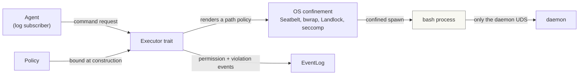

# agentd sandbox design

The sandbox is the confinement layer through which an agent drives shell
commands. **The boundary is the OS, not an in-process check**: the policy is
rendered into the platform's native isolation mechanism (Seatbelt on macOS,
bubblewrap/Landlock + seccomp on Linux) and a spawned command runs inside it.
Permission decisions and policy violations are durably appended as CloudEvents
to the event log, so approval flows and audit trails are built from the same
choreography model as everything else in `agentd`.

The design borrows its model from [openai/codex](https://github.com/openai/codex)
(see `docs/research/codex-sandboxing.md`) — argv rewriting plus kernel-enforced
confinement, deny-by-default, a filesystem path policy with `deny > write >
read`, and a network that is denied rather than left open. It also keeps the
one idea codex lacks: **every decision and every denial is a durable event**, not
a log line.

## Goals and non-goals

Goals:

- An agent can run bash commands with filesystem access confined by a `Policy`,
  enforced by the kernel.
- **No network egress.** The sandbox cannot reach any host on the network. The
  only reachable endpoint is the daemon's Unix socket, so the agent reaches its
  model provider *through the daemon*: the daemon holds the provider credentials
  and performs inference on the agent's behalf. The sandbox never holds network
  credentials and never opens an IP connection.
- Filesystem permissions are configurable per sandbox instance.
- Permission grants, denials, and policy violations are durable events in the
  log, enabling human-in-the-loop approval by any WS client.
- The execution strategy behind the shell is swappable.

Non-goals (stated honestly, per the Sheena precedent):

- No hard per-process memory ceiling on macOS (no cgroups equivalent); memory
  caps are best-effort there.
- The sandbox is not a boundary for hostile native code. It confines the tool
  calls an agent *requests* against a configured policy.
- **No general network allowlist.** Egress is denied outright, not filtered by
  host; the only network grant is a per-path Unix socket the daemon itself
  needs. A future non-daemon remote service would need the managed-proxy model
  (codex's `network-proxy` + netns bridge) as a separate, opt-in layer; it is
  not built now because the daemon-mediated path covers inference.
- **Cedar is not adopted.** A policy language was considered for the path rules
  and dropped: the rules are path lists with three access levels, and the layer-1
  profile is rendered from them directly. Revisit only if policies must be
  authored outside the Rust code.

## Design principles

1. **Deny-by-default.** Nothing runs, no file is written, no connection is
   opened until the policy opts in. The zero value of a `Policy` is fully inert.
2. **The OS is the only boundary.** Path confinement that the kernel itself
   guarantees (Seatbelt profiles, bubblewrap bind mounts, Landlock rulesets) is
   the boundary. In-process path checks are defense in depth for future
   executors, never the guarantee — a confused-deputy command can bypass them.
3. **One path policy, three access levels.** A single list of path entries
   (`read`, `write`, `deny`) with the precedence `deny > write > read` is the
   whole filesystem policy. There is no separate "mount", "refuse", and
   "hide" machinery to reconcile.
4. **Swappable executors.** The shell execution strategy sits behind an
   `Executor` trait. Layer 1 maps the policy onto the OS. The policy is the
   interface: a new OS backend (Linux) renders the same entries differently.
5. **Every decision is an event.** Each permission check produces a CloudEvent
   (`requested` → `granted`/`denied`) and each policy violation produces a
   `sandbox.violation.*` event, durably appended to the log, so the audit log is
   the log itself.
6. **Kernel-enforced over convention-enforced.** Where the OS offers a stronger
   primitive (bubblewrap mount namespaces over Landlock path rules, a writable
   root's unlink denial over trusting a path check), use it.

## Policy model

`Policy` has four domains; its default is deny-everything:

| Domain    | What it controls                                                            |
| --------- | --------------------------------------------------------------------------- |
| `fs`      | Path entries (`read`/`write`/`deny`) and protected metadata names            |
| `shell`   | Environment and working directory                                           |
| `network` | Unix domain sockets the command may connect to (nothing by default)          |
| `limits`  | Wall-clock timeout and output cap                                           |

There is no IP grant: the sandbox has no use for one, and the daemon is reached
over a local socket. There is no command allowlist and no memory or byte cap —
each was deleted because it did not hold (an allowlist is a bypassable UX guard;
macOS cannot enforce a memory cap). See "What was deleted" below.

```rust
pub struct Policy {
    pub fs: FsPolicy,
    pub shell: ShellPolicy,
    pub network: NetworkPolicy,
    pub limits: Limits,
}

pub struct NetworkPolicy {
    /// Unix domain sockets the command may connect to, by path.
    pub unix_sockets: Vec<PathBuf>,
}

pub struct FsPolicy {
    /// Path entries, evaluated with `deny > write > read`.
    pub entries: Vec<FsEntry>,
    /// Names fixed read-only inside any write root. Defaults to `.git` and
    /// `.agents`, so a command cannot rewrite its own instructions or the repo
    /// history it is diffed against.
    pub protected: Vec<String>,
}

pub struct FsEntry {
    pub path: PathBuf,   // a directory (subpath) or a file (literal)
    pub access: Access,  // Read | Write | Deny
}

pub struct ShellPolicy {
    pub env: EnvAllowlist, // the host environ is never inherited
    pub workdir: PathBuf,  // must be covered by a `write` entry
}

pub struct Limits {
    pub timeout: Duration,
    pub max_output_bytes: u64,
}
```

### Filesystem entries

- **Precedence is `deny > write > read`.** An entry grants or removes access;
  the most restrictive matching entry wins, so a `deny` inside a broad `write`
  root holds.
- **Read is granted broadly, then narrowed.** On macOS 26 a filtered read grant
  makes platform binaries abort inside `dyld4::CacheFinder` (`SIGABRT` before the
  shell starts), so reads are granted at `/` and `deny` entries are emitted as
  denials after the broad grant. Seatbelt evaluates a deny ahead of a matching
  allow, so this holds for a spawned host binary.
- **Entries are validated.** An entry must be an absolute host path that
  resolves. A `deny` must not cover the workdir, an executable directory, a write
  root, or the sandbox scratch directory — every command needs those — and a
  failure there is an `InvalidPolicy` error at construction, not a
  silently-ignored entry. `~` is a shell expansion and is *not* performed on a
  path.
- **Canonicalisation is required.** The profile matches resolved paths, so
  `/tmp` is `/private/tmp`; both the entries and the protected paths are resolved
  before comparison.
- **The workdir must be inside a `write` entry**, so a workspace a command
  cannot write is rejected rather than silently run read-only.

### Protected metadata

Inside a write root, `protected` names are forced read-only with a
`(deny file-write* (regex #"^<root>/<name>(/.*)?$"))` rule, so the protection
holds even before the directory exists (a fresh `.git` cannot be created). The
default protects `.git` and `.agents`. The root path and the name are
regex-escaped, so a path arriving as event data cannot inject a clause.

### Writable roots and renames

A writable root receives a `(deny file-write-unlink (require-all (literal
<root>) (vnode-type DIRECTORY)))` rule, so a command cannot rename or unlink the
root itself. Without it, a command could replace the directory the *next*
sandbox profile will treat as a boundary.

### Network

Egress and ingress are denied at the OS level by `deny default` (macOS) /
bubblewrap's `--unshare-all`, or Landlock net rules in the fallback (Linux); the
only exception is the `network.unix_sockets` list. Inference — the reason an
earlier design left egress open — is a daemon capability: the agent asks the
daemon over its Unix socket, and the daemon holds the provider credentials and
reaches the network.
The sandbox thus has no IP exfiltration channel, so per-host rules and an SSRF
guard are unnecessary. A future remote service reached directly would
reintroduce the managed-proxy model as a separate opt-in.

The daemon grants its own event socket to the session policy when it starts the
manager, so a launched node can reach the daemon that supervises it. On macOS
the grant is path-scoped: each socket renders as
`(allow network-outbound (remote unix-socket (regex #"^.*<path>$")))`, which
Seatbelt consults only for an AF_UNIX connect and requires to end with the named
path. Path-scoped `literal`/`subpath` filters do **not** work for a Unix socket
(verified on macOS 26.6.2: they silently fail to match), and an unfiltered
`(allow network-outbound)` would open all IP egress, so the `remote unix-socket`
form is the one that keeps egress denied while permitting exactly the daemon
socket. The `^.*` prefix is required because Seatbelt matches the path with an
address prefix ahead of it; the trailing `$` is what rejects a sibling socket
like `<path>X`.

## What was deleted

A first-principles pass removed concepts that did not hold:

- **The virtual filesystem.** The `Vfs` trait and its `Mem`/`ReadOnly`/
  `ReadWrite`/`Overlay` backends plus `VPath` were described as a shared resource
  plane, but the executor never used them, so they never constrained a spawned
  command; the OS profile was always the boundary. They were speculative
  infrastructure for an interpreter that does not exist.
- **The shell allowlist.** Continue-prefix matching was a convenience guard, not
  a boundary: a spawned interpreter bypasses a prefix list. The OS profile
  decides what a command can reach, so the list (and its `CommandPrefix` type,
  the clause splitter, and the `DenyReasons` it produced) is gone.
- **Resource caps that nothing enforced.** `max_memory_bytes`, `max_total_bytes`,
  and `max_file_bytes` were configuration-only on macOS; a field with no
  enforcement is a false promise.
- **`NetworkPolicy` as a host/IP allowlist.** With egress denied there was no
  surface to configure. It returns as a single list of Unix socket paths — the
  narrowest form the daemon actually needs — and still has no IP grant.
- **Glob-based `refuse`/`hide`.** They only made sense at the deleted VFS layer.
- **The command-count guard.** It counted `exec` calls, not processes, so it did
  not bound a fork bomb.

## Architecture

The sandbox ships as a first-class workspace crate, `agentd-sandbox`: it depends
on `agentd-events` only and is wired into `agentd` behind a cargo feature
(`sandbox = ["dep:agentd-sandbox"]`).



| Component                  | Crate            | Role                                                                                     |
| -------------------------- | ---------------- | ---------------------------------------------------------------------------------------- |
| `Policy`                   | `agentd-sandbox` | The four-domain deny-by-default configuration; serializable so it can arrive as an event. |
| Path renderer              | `agentd-sandbox` | Renders `FsPolicy` entries into a Seatbelt profile / bwrap args / Landlock ruleset.       |
| `Executor` trait           | `agentd-sandbox` | Runs a command string under a policy; returns `Result { stdout, stderr, exit_code }`.     |
| `ConfinedProcessExecutor`  | `agentd-sandbox` | Layer 1: builds the OS profile and spawns a real bash.                                    |
| Violation classifier       | `agentd-sandbox` | Maps an exit code and output to a structured `sandbox.violation.*` event.                 |
| Permission publisher       | `agentd-sandbox` | Emits `sandbox.permission.*` CloudEvents for every policy evaluation.                     |

### Executor trait

```rust
pub trait Executor: Send + Sync {
    /// The policy is bound at executor construction, not per call, so a
    /// running executor cannot widen its own permissions.
    async fn exec(&self, command: &str) -> ExecResult;
    /// Spawns a long-lived process with piped stdio.
    async fn spawn(&self, command: &str) -> Result<Child, SpawnError>;
}

pub struct ExecResult {
    pub stdout: String,
    pub stderr: String,
    pub exit_code: i32,
    pub denied: bool, // set when an approver denied the command
}
```

`spawn` defaults to an error, so an executor that only supports one-shot
commands cannot back a session; the layer-1 executor overrides it.

### Sessions

`Sandbox::spawn(command)` runs a long-lived process with piped stdio for the
node model in `docs/node.md`. It goes through the same approval as `exec` once,
at spawn, and appends `sandbox.session.started`; `Session::wait` appends
`sandbox.session.exited` with the exit code and duration. The caller takes the
pipes (`take_stdin`/`take_stdout`/`take_stderr`) and owns the I/O; the output is
not captured, so a session is not bounded by the one-shot output cap. The
session holds the executor alive, so the profile and scratch it was spawned
under outlive the `Sandbox` handle, and it is killed on drop if it is still
running. Because the whole process is confined by one profile and its children
inherit it, per-command `sandbox.permission.*` events are not emitted for a
session — its lifecycle events are the audit trail.

The daemon's session manager (`agentd::session`, behind the `sandbox` feature)
drives this from the log: a `session.requested` event starts the *configured*
node command (never a command carried in the event), and its lifecycle is
reported as `session.started`/`exited`/`failed`. Supervision is opt-in: a
session may be restarted up to `max_restarts` times when it exits non-zero
(`session.restarted`), and may be given a `lifetime`, after which it is killed
(`session.failed`). A `session.status.requested` event is answered with a
`session.status` listing the active sessions. On startup the manager reconciles
the in-memory active set with the durable log: a session the log shows as
started but never terminated is recorded as failed (a restarted daemon cannot
re-adopt a process it did not spawn), so the status never reports a phantom
session. The daemon binary starts the manager when `--session-command` (with
`--sandbox-policy`) is given.

### Layer 1 backends

| Concern                | Linux                                                        | macOS                                 |
| ---------------------- | ------------------------------------------------------------ | ------------------------------------- |
| Filesystem confinement | bubblewrap: read-only host root, read-write write entries; Landlock allowlist fallback | Seatbelt profile `(deny default)`      |
| Denials                | bubblewrap masks after the binds; Landlock omits the path    | `deny` read rules after the broad read grant |
| Syscall narrowing      | seccomp deny-list in the fallback (`ptrace`, `io_uring_*`, `bpf`, `userfaultfd`, ...) | not available; profile covers most    |
| Process isolation      | `--unshare-all`, `--die-with-parent`                          | not available                         |
| Network                | `--unshare-all` drops the network namespace; the fallback denies TCP with Landlock net rules | `deny default`; only `network.unix_sockets` granted |
| Host binary control    | a fixed system `PATH`; the profile, not the path, confines    | same                                  |

**bubblewrap is preferred over Landlock** because it gives a read-only host root,
a private `/dev`, namespaces, and network isolation in one mechanism, whereas
Landlock confines paths only and cannot subtract a nested denial. The binary is
looked up on `PATH` and a `bwrap` inside a policy `write` root is rejected, so a
repository cannot supply the very binary that builds the boundary. Reads are
broad (the whole host root is bound read-only), matching macOS; write entries are
bound read-write; an existing protected name (`.git`, `.agents`) inside a write
root is re-bound read-only; a `deny` nested in a write root is masked after the
binds, so a later mount overrides the earlier grant. Unlike macOS, that mask
hides a denied directory entirely rather than carving it out read-only, and
`AF_UNIX` sockets are not path-scoped because `--unshare-net` does not isolate
them — stated gaps.

**When bubblewrap is absent**, the [`agentd-sandbox-helper`](#the-landlock-helper)
binary applies a Landlock allowlist and a seccomp deny-list before `exec`. The
executor renders the policy into the path allowlist (system roots read-execute,
read entries read-only, write roots read-write, `deny` entries omitted because
Landlock cannot subtract), writes it to the scratch directory, and invokes the
helper. The helper also handles Landlock network access without allowing it, so
TCP bind and connect are denied; `AF_UNIX` is unaffected. Network handling needs
Landlock ABI v4 (Linux 6.7) and is best-effort, so on an older kernel the
fallback leaves egress unconfined — a stated gap.

### The Landlock helper

Applying confinement to a child without the `unsafe` `pre_exec` the workspace
forbids needs a separate program. The helper is a dedicated binary
(`agentd-sandbox-helper`) rather than an `argv[0]` overloading of the daemon:
a separate binary is directly testable and needs no daemon wiring. It is found
on `PATH`, or via `AGENTD_SANDBOX_HELPER`; a helper inside a policy `write` root
is rejected. It is invoked as `agentd-sandbox-helper <spec> <program> [args...]`
and fails closed: any setup error exits non-zero before `exec`, so the command
never runs unconfined. It is a workspace binary, so it must be built explicitly
(`cargo build --workspace --bins`) and installed next to the daemon or on
`PATH`; a dependency build does not produce it.

## Permission and violation events

Every policy evaluation and every OS-enforced denial publishes events with the
existing dotted-type convention and `source: urn:mokmokd`:

| Kind                          | When                                                              |
| ----------------------------- | ----------------------------------------------------------------- |
| `sandbox.permission.requested` | A command or resource access needs a decision                     |
| `sandbox.permission.granted`  | A static policy rule or an approver allowed it                    |
| `sandbox.permission.denied`   | A static policy rule or an approver refused it (deny wins)        |
| `sandbox.violation.filesystem` | The OS refused a filesystem operation: reason, denied path, output snippet |
| `sandbox.violation.network`   | The OS refused a network operation                                 |
| `sandbox.exec.completed`      | Terminal state of an execution: exit code, duration, output sizes |
| `sandbox.session.started`     | A long-lived session was spawned                                  |
| `sandbox.session.exited`      | Terminal state of a session: exit code and duration               |
| `session.requested`           | A client asks the daemon to start a managed session               |
| `session.started`             | The managed session's sandboxed process started                   |
| `session.restarted`           | The managed session's process restarted after a non-zero exit     |
| `session.exited`              | The managed session's process exited                              |
| `session.failed`              | The managed session could not start, or exceeded its lifetime     |
| `session.status.requested`    | A client asks for the active managed sessions                     |
| `session.status`              | The list of active managed sessions                               |

Every permission event carries a `request_id` (a UUID) alongside `sandbox_id`, so
a decision is correlated to one request even when execs run concurrently.
`decision` in `requested` is `auto` when a static rule granted immediately and
`pending` when human approval is configured. An approver is a WS client that
reacts to `requested` by publishing a `granted`/`denied` event carrying the same
`request_id`; it authenticates with a token holding the `authority` claim, so a
client without it cannot publish a `sandbox.permission.*` event (see
[architecture](architecture.md#access-control)).

With `Approval::Auto` the sandbox publishes `requested`(`auto`) and then
`granted` itself. With `Approval::Required { timeout }` it publishes
`requested`(`pending`) and awaits a matching decision: a grant proceeds (the
approver's `granted` is the durable record, so it is not republished), a denial
returns a denied `ExecResult`, and a timeout records a `denied` itself and
returns a denied result. A decision that does not carry the request's id is
ignored, so one request cannot release another.

A violation event is the improvement over codex, which classifies
`operation not permitted` / `read-only file system` / `SIGSYS` but only emits a
`tracing::warn`: here the reason (`OperationNotPermitted`, `ReadOnlyFileSystem`,
`PolicyDenied`, `SignalSyscall`, ...), the denied path, and a bounded output
snippet become durable, correlated state.

## Security guarantees and stated gaps

Prevented:

- Path traversal and symlink escape out of a writable root, and replacement of
  the writable root itself (kernel-enforced on Linux via mount namespaces; the
  Seatbelt profile on macOS, with symlink rejection at construction).
- Rewriting `.git` or `.agents` inside a writable root (protected-carveout
  rules).
- Host environment leakage (env is an allowlist; the host environ is never
  inherited).
- Runaway loops (wall-clock timeout).
- Silent host contamination by default (writes require an explicit `write`
  entry).
- **Self-approval.** A client cannot publish a `sandbox.permission.*` event
  without the `authority` claim, so an agent cannot approve its own command.
- **Network egress.** A confined command cannot open an IP connection; the only
  network reachable is a Unix socket the policy names.
- Reads of the paths named in `deny` entries, held against a spawned host
  binary and verified end to end.

Stated gaps:

- **No hard memory ceiling for spawned commands.** There is no memory cap at all:
  macOS has no enforcement mechanism, so a field would be a false promise.
- **Layer 1 runs real host binaries.** A command can still do
  surprising-but-confined things; the confinement boundary is the OS profile.
- **macOS Seatbelt is officially unsupported by Apple.** It is functional and
  widely used, but profiles are best-effort and behavior can shift between OS
  releases.
- **Reads are unconfined unless a `deny` entry names them.** With no denial, a
  spawned host binary can read any file the user can. With egress denied outright
  the exfiltration channel is closed, but a secret read still reaches the model
  context, so operators should name credentials in `deny` entries.
- **A hard link inside a write root aliases a file outside it.** The write
  allow-list matches paths, so a pre-existing hard link under the root can be
  written through. Creating the link requires access outside the sandbox, so it
  is a precondition, not something a confined command can set up.
- **Linux denials are coarser than macOS.** With bubblewrap a `deny` nested in a
  write root is masked (hidden) rather than carved out read-only, and a fresh
  protected name can still be created inside a write root. With the Landlock
  fallback a nested `deny` is not enforced at all (Landlock cannot subtract), and
  TCP denial needs Landlock ABI v4 (Linux 6.7) — on an older kernel the fallback
  leaves egress unconfined. `AF_UNIX` sockets are not path-scoped on either
  backend.

## Testing strategy

Modeled on Sheena's methodology and codex's, adapted to Rust:

- **Category-organized security tests**: sandbox escape (`../`, symlink out of a
  root), writable-root rename, output flood, timeout, env leakage, and a `deny`
  entry withholding a secret from a real spawned process.
- **Path precedence tests**: `deny` inside `write` holds; protected metadata
  cannot be created or modified; canonicalisation collapses `/tmp`.
- **Permission flow tests**: end-to-end through the log — `requested` →
  `granted` → `exec.completed`, and `Approval::Required` granting, denying, and
  timing out over the log with `request_id` correlation.
- **Violation flow tests**: a structured `sandbox.violation.*` for a recognised
  OS denial, and no violation for an unrelated failure.
- **Session tests**: `sandbox.session.started`/`exited` over the log, piped
  stdin/stdout streaming, approval denial, a real confined session that streams
  I/O under the Seatbelt profile, and a real sandboxed process that reaches a
  granted Unix socket but not an ungranted one.
- **Session manager tests**: `session.*` lifecycle, restart within the budget, a
  lifetime kill, a spawn failure, a status request answered with the active
  sessions, and startup reconciliation (an open session is failed, a terminated
  one is left alone).
- **Linux tests**: the bubblewrap argument renderer, and, where a namespace can
  be built, real writes reaching a write entry, a denial masking a path, an
  outside write failing, environment scrubbing, session streaming, and a
  timeout killing the process group; the Landlock spec, and a real Landlock
  session that confines the filesystem, refuses a denied read, denies TCP, and
  reports seccomp active through `/proc/self/status`. The Nix build sandbox
  cannot nest bubblewrap, so those spawn tests skip there as on macOS.
- **Differential tests**: golden files recorded from real bash + coreutils for
  layer 1 behavior, replayed in CI without the recorded host.
- **Benchmarks**: sandbox construction, trivial `exec` overhead, parallel
  sandbox throughput — the "lighter than a container" claim must be measured.

## Roadmap

Triggers, not dates — none of these steps are taken early:

1. The macOS differential test corpus: golden files from real bash and coreutils,
   replayed in CI without the recorded host.
2. Benchmarks: sandbox construction, trivial `exec` overhead, and parallel
   throughput, to measure the "lighter than a container" claim.

## Implementation status

The crate matches this design: `Policy` is the four-domain
model (filesystem path entries, shell, network Unix sockets, limits) with no
allowlist or caps, the macOS profile renders the entries with protected metadata
and root-unlink denial, denies IP egress, and grants only the policy's Unix
domain sockets by path, the Linux executor renders the policy into a bubblewrap
command (read-only host root, read-write write entries, masked denials, network
unshared) or, without bubblewrap, into a Landlock allowlist plus a seccomp
deny-list applied by the `agentd-sandbox-helper` binary, a denial is classified
into a `sandbox.violation.*` event, the human-in-the-loop approval flow runs over
the log with `request_id` correlation, the long-lived session spawn API is in
place, and the deleted concepts (VFS, allowlist, caps) are gone from the code.
The daemon-side `agentd::session` manager is started by the binary
(`--session-command` with `--sandbox-policy`), grants the daemon's own socket to
the session policy, launches a configured node on `session.requested`, reports
`session.*` lifecycle, restarts within a budget, enforces a lifetime, reconciles
the durable log on startup (failing any session the previous daemon left open),
and answers a status request. The remaining work is the stated gaps above, not a
missing backend. A crate doc comment records the same status next to the code.
