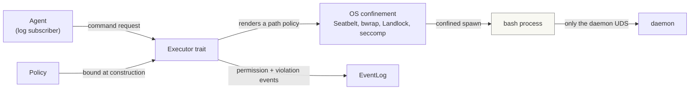

# agentd sandbox design

The sandbox is the confinement layer through which an agent drives shell
commands. **The boundary is the OS, not an in-process check**: the policy is
rendered into the platform's native isolation mechanism (Seatbelt on macOS,
bubblewrap/Landlock + seccomp on Linux) and a spawned command runs inside it.
Permission decisions and policy violations are durably appended as CloudEvents
to the event log, so approval flows and audit trails are built from the same
choreography model as everything else in `agentd`.

The design borrows its model from [openai/codex](https://github.com/openai/codex)
(see `docs/research/codex-sandboxing.md`) — argv rewriting plus kernel-enforced
confinement, deny-by-default, a filesystem path policy with `deny > write >
read`, and a network that is denied rather than left open. It also keeps the
one idea codex lacks: **every decision and every denial is a durable event**, not
a log line.

## Goals and non-goals

Goals:

- An agent can run bash commands with filesystem access confined by a `Policy`,
  enforced by the kernel.
- **No network egress.** The sandbox cannot reach any host on the network. The
  only reachable endpoint is the daemon's Unix socket, so the agent reaches its
  model provider *through the daemon*: the daemon holds the provider credentials
  and performs inference on the agent's behalf. The sandbox never holds network
  credentials and never opens an IP connection.
- Filesystem permissions are configurable per sandbox instance.
- Permission grants, denials, and policy violations are durable events in the
  log, enabling human-in-the-loop approval by any WS client.
- The execution strategy behind the shell is swappable.

Non-goals (stated honestly, per the Sheena precedent):

- No hard per-process memory ceiling on macOS (no cgroups equivalent); memory
  caps are best-effort there.
- The sandbox is not a boundary for hostile native code. It confines the tool
  calls an agent *requests* against a configured policy.
- **No general network allowlist.** Egress is denied outright, not filtered by
  host. A future non-daemon remote service would need the managed-proxy model
  (codex's `network-proxy` + netns bridge) as a separate, opt-in layer; it is
  not built now because the daemon-mediated path covers inference.
- **Cedar is not adopted.** A policy language was considered for the path rules
  and dropped: the rules are path lists with three access levels, and the layer-1
  profile is rendered from them directly. Revisit only if policies must be
  authored outside the Rust code.

## Design principles

1. **Deny-by-default.** Nothing runs, no file is written, no connection is
   opened until the policy opts in. The zero value of a `Policy` is fully inert.
2. **The OS is the only boundary.** Path confinement that the kernel itself
   guarantees (Seatbelt profiles, bubblewrap bind mounts, Landlock rulesets) is
   the boundary. In-process path checks are defense in depth for future
   executors, never the guarantee — a confused-deputy command can bypass them.
3. **One path policy, three access levels.** A single list of path entries
   (`read`, `write`, `deny`) with the precedence `deny > write > read` is the
   whole filesystem policy. There is no separate "mount", "refuse", and
   "hide" machinery to reconcile.
4. **Swappable executors.** The shell execution strategy sits behind an
   `Executor` trait. Layer 1 maps the policy onto the OS. The policy is the
   interface: a new OS backend (Linux) renders the same entries differently.
5. **Every decision is an event.** Each permission check produces a CloudEvent
   (`requested` → `granted`/`denied`) and each policy violation produces a
   `sandbox.violation.*` event, durably appended to the log, so the audit log is
   the log itself.
6. **Kernel-enforced over convention-enforced.** Where the OS offers a stronger
   primitive (bubblewrap mount namespaces over Landlock path rules, a writable
   root's unlink denial over trusting a path check), use it.

## Policy model

`Policy` has three domains; its default is deny-everything:

| Domain   | What it controls                                                            |
| -------- | --------------------------------------------------------------------------- |
| `fs`     | Path entries (`read`/`write`/`deny`) and protected metadata names            |
| `shell`  | Environment and working directory                                           |
| `limits` | Wall-clock timeout and output cap                                           |

Network is not a domain: it has no configurable surface because egress and
ingress are denied. There is no command allowlist and no memory or byte cap —
each was deleted because it did not hold (an allowlist is a bypassable UX guard;
macOS cannot enforce a memory cap). See "What was deleted" below.

```rust
pub struct Policy {
    pub fs: FsPolicy,
    pub shell: ShellPolicy,
    pub limits: Limits,
}

pub struct FsPolicy {
    /// Path entries, evaluated with `deny > write > read`.
    pub entries: Vec<FsEntry>,
    /// Names fixed read-only inside any write root. Defaults to `.git` and
    /// `.agents`, so a command cannot rewrite its own instructions or the repo
    /// history it is diffed against.
    pub protected: Vec<String>,
}

pub struct FsEntry {
    pub path: PathBuf,   // a directory (subpath) or a file (literal)
    pub access: Access,  // Read | Write | Deny
}

pub struct ShellPolicy {
    pub env: EnvAllowlist, // the host environ is never inherited
    pub workdir: PathBuf,  // must be covered by a `write` entry
}

pub struct Limits {
    pub timeout: Duration,
    pub max_output_bytes: u64,
}
```

### Filesystem entries

- **Precedence is `deny > write > read`.** An entry grants or removes access;
  the most restrictive matching entry wins, so a `deny` inside a broad `write`
  root holds.
- **Read is granted broadly, then narrowed.** On macOS 26 a filtered read grant
  makes platform binaries abort inside `dyld4::CacheFinder` (`SIGABRT` before the
  shell starts), so reads are granted at `/` and `deny` entries are emitted as
  denials after the broad grant. Seatbelt evaluates a deny ahead of a matching
  allow, so this holds for a spawned host binary.
- **Entries are validated.** An entry must be an absolute host path that
  resolves. A `deny` must not cover the workdir, an executable directory, a write
  root, or the sandbox scratch directory — every command needs those — and a
  failure there is an `InvalidPolicy` error at construction, not a
  silently-ignored entry. `~` is a shell expansion and is *not* performed on a
  path.
- **Canonicalisation is required.** The profile matches resolved paths, so
  `/tmp` is `/private/tmp`; both the entries and the protected paths are resolved
  before comparison.
- **The workdir must be inside a `write` entry**, so a workspace a command
  cannot write is rejected rather than silently run read-only.

### Protected metadata

Inside a write root, `protected` names are forced read-only with a
`(deny file-write* (regex #"^<root>/<name>(/.*)?$"))` rule, so the protection
holds even before the directory exists (a fresh `.git` cannot be created). The
default protects `.git` and `.agents`. The root path and the name are
regex-escaped, so a path arriving as event data cannot inject a clause.

### Writable roots and renames

A writable root receives a `(deny file-write-unlink (require-all (literal
<root>) (vnode-type DIRECTORY)))` rule, so a command cannot rename or unlink the
root itself. Without it, a command could replace the directory the *next*
sandbox profile will treat as a boundary.

### Network

Network has no allow surface. Egress and ingress are denied at the OS level by
`deny default` (macOS) / `--unshare-net` plus a seccomp filter (Linux). Inference
— the reason an earlier design left egress open — is a daemon capability: the
agent asks the daemon over its Unix socket, and the daemon holds the provider
credentials and reaches the network. The sandbox thus has no exfiltration
channel, so per-host rules and an SSRF guard are unnecessary. The daemon-socket
exception arrives with the session manager; until then the profile denies all
network access, and a future remote service reached directly would reintroduce
the managed-proxy model as a separate opt-in.

## What was deleted

A first-principles pass removed concepts that did not hold:

- **The virtual filesystem.** The `Vfs` trait and its `Mem`/`ReadOnly`/
  `ReadWrite`/`Overlay` backends plus `VPath` were described as a shared resource
  plane, but the executor never used them, so they never constrained a spawned
  command; the OS profile was always the boundary. They were speculative
  infrastructure for an interpreter that does not exist.
- **The shell allowlist.** Continue-prefix matching was a convenience guard, not
  a boundary: a spawned interpreter bypasses a prefix list. The OS profile
  decides what a command can reach, so the list (and its `CommandPrefix` type,
  the clause splitter, and the `DenyReasons` it produced) is gone.
- **Resource caps that nothing enforced.** `max_memory_bytes`, `max_total_bytes`,
  and `max_file_bytes` were configuration-only on macOS; a field with no
  enforcement is a false promise.
- **`NetworkPolicy`.** With egress denied there is no surface to configure.
- **Glob-based `refuse`/`hide`.** They only made sense at the deleted VFS layer.
- **The command-count guard.** It counted `exec` calls, not processes, so it did
  not bound a fork bomb.

## Architecture

The sandbox ships as a first-class workspace crate, `agentd-sandbox`: it depends
on `agentd-events` only and is wired into `agentd` behind a cargo feature
(`sandbox = ["dep:agentd-sandbox"]`).



| Component                  | Crate            | Role                                                                                     |
| -------------------------- | ---------------- | ---------------------------------------------------------------------------------------- |
| `Policy`                   | `agentd-sandbox` | The four-domain deny-by-default configuration; serializable so it can arrive as an event. |
| Path renderer              | `agentd-sandbox` | Renders `FsPolicy` entries into a Seatbelt profile / bwrap args / Landlock ruleset.       |
| `Executor` trait           | `agentd-sandbox` | Runs a command string under a policy; returns `Result { stdout, stderr, exit_code }`.     |
| `ConfinedProcessExecutor`  | `agentd-sandbox` | Layer 1: builds the OS profile and spawns a real bash.                                    |
| Violation classifier       | `agentd-sandbox` | Maps an exit code and output to a structured `sandbox.violation.*` event.                 |
| Permission publisher       | `agentd-sandbox` | Emits `sandbox.permission.*` CloudEvents for every policy evaluation.                     |

### Executor trait

```rust
pub trait Executor: Send + Sync {
    /// The policy is bound at executor construction, not per call, so a
    /// running executor cannot widen its own permissions.
    async fn exec(&self, command: &str) -> ExecResult;
}

pub struct ExecResult {
    pub stdout: String,
    pub stderr: String,
    pub exit_code: i32,
}
```

There is no `denied_by`: the sandbox no longer refuses a command before running
it, because there is no allowlist. A refusal is an OS denial, visible as a
non-zero exit code and classified into a `sandbox.violation.*` event.

### Layer 1 backends

| Concern                | Linux                                                        | macOS                                 |
| ---------------------- | ------------------------------------------------------------ | ------------------------------------- |
| Filesystem confinement | bubblewrap bind mounts (preferred); Landlock ABI V5 fallback  | Seatbelt profile `(deny default)`      |
| Syscall narrowing      | seccomp filter (block `ptrace`, `io_uring_*`, network)        | not available; profile covers most    |
| Process isolation      | `--unshare-user/pid/ipc`, `--unshare-net`                     | not available                         |
| Network                | `--unshare-net` + seccomp                                     | denied by `deny default` (no grant)   |
| Host binary control    | a fixed system `PATH`; the profile, not the path, confines    | same                                  |

**bubblewrap is preferred over Landlock** because it gives read-only root binds,
a private `/dev`, namespaces, and `--cap-drop ALL` in one mechanism, whereas
Landlock confines paths only. `find_system_bwrap_in_path` must exclude a `bwrap`
inside the workspace, so a repo cannot supply the very binary that builds the
boundary. When the system bwrap lacks `--ro-bind-fd`, it is rewritten to
`--ro-bind /proc/self/fd/<fd>` with a mount verification.

**One binary, two personalities.** The Linux helper is not a second binary:
`agentd` places a `agentd-sandbox` symlink to its own executable in its runtime
directory, prepends that directory to `PATH`, and dispatches on `argv[0]`
(`codex-linux-sandbox`'s arg0 trick). This keeps the helper on a trusted path and
avoids shipping and locating a separate executable.

## Permission and violation events

Every policy evaluation and every OS-enforced denial publishes events with the
existing dotted-type convention and `source: urn:mokmokd`:

| Kind                          | When                                                              |
| ----------------------------- | ----------------------------------------------------------------- |
| `sandbox.permission.requested` | A command or resource access needs a decision                     |
| `sandbox.permission.granted`  | A static policy rule or an approver allowed it                    |
| `sandbox.permission.denied`   | A static policy rule or an approver refused it (deny wins)        |
| `sandbox.violation.filesystem` | The OS refused a filesystem operation: reason, denied path, output snippet |
| `sandbox.violation.network`   | The OS refused a network operation                                 |
| `sandbox.exec.completed`      | Terminal state of an execution: exit code, duration, output sizes |

`decision` in `requested` is `pending` when human approval is configured and
`auto` when a static rule decided immediately. An approver is a WS client that
reacts to `requested` by publishing a `granted`/`denied` event carrying the same
`sandbox_id`; it authenticates with a token holding the `authority` claim, so a
client without it cannot publish a `sandbox.permission.*` event (see
[architecture](architecture.md#access-control)).

A violation event is the improvement over codex, which classifies
`operation not permitted` / `read-only file system` / `SIGSYS` but only emits a
`tracing::warn`: here the reason (`OperationNotPermitted`, `ReadOnlyFileSystem`,
`PolicyDenied`, `SignalSyscall`, ...), the backend, and a bounded output snippet
become durable, correlated state.

## Security guarantees and stated gaps

Prevented:

- Path traversal and symlink escape out of a writable root, and replacement of
  the writable root itself (kernel-enforced on Linux via mount namespaces; the
  Seatbelt profile on macOS, with symlink rejection at construction).
- Rewriting `.git` or `.agents` inside a writable root (protected-carveout
  rules).
- Host environment leakage (env is an allowlist; the host environ is never
  inherited).
- Runaway loops (wall-clock timeout).
- Silent host contamination by default (writes require an explicit `write`
  entry).
- **Network egress.** A confined command cannot open an IP connection.
- Reads of the paths named in `deny` entries, held against a spawned host
  binary and verified end to end.

Stated gaps:

- **No hard memory ceiling for spawned commands.** There is no memory cap at all:
  macOS has no enforcement mechanism, so a field would be a false promise.
- **Layer 1 runs real host binaries.** A command can still do
  surprising-but-confined things; the confinement boundary is the OS profile.
- **macOS Seatbelt is officially unsupported by Apple.** It is functional and
  widely used, but profiles are best-effort and behavior can shift between OS
  releases.
- **Reads are unconfined unless a `deny` entry names them.** With no denial, a
  spawned host binary can read any file the user can. With egress denied outright
  the exfiltration channel is closed, but a secret read still reaches the model
  context, so operators should name credentials in `deny` entries.
- **A hard link inside a write root aliases a file outside it.** The write
  allow-list matches paths, so a pre-existing hard link under the root can be
  written through. Creating the link requires access outside the sandbox, so it
  is a precondition, not something a confined command can set up.
- **Linux is not implemented yet.** The bwrap/Landlock/seccomp backends and the
  arg0 helper are the immediate follow-up; the crate compiles on Linux but runs
  nothing.

## Testing strategy

Modeled on Sheena's methodology and codex's, adapted to Rust:

- **Category-organized security tests**: sandbox escape (`../`, symlink out of a
  root), writable-root rename, output flood, timeout, env leakage, and a `deny`
  entry withholding a secret from a real spawned process.
- **Path precedence tests**: `deny` inside `write` holds; protected metadata
  cannot be created or modified; canonicalisation collapses `/tmp`.
- **Permission flow tests**: end-to-end through the log — `requested` →
  `granted` → `exec.completed`.
- **Violation flow tests**: a structured `sandbox.violation.*` for a recognised
  OS denial, and no violation for an unrelated failure.
- **Differential tests**: golden files recorded from real bash + coreutils for
  layer 1 behavior, replayed in CI without the recorded host.
- **Benchmarks**: sandbox construction, trivial `exec` overhead, parallel
  sandbox throughput — the "lighter than a container" claim must be measured.

## Roadmap

Triggers, not dates — none of these steps are taken early:

1. Allow the daemon UDS in the rendered profile when the session manager needs
   it (egress is otherwise denied already).
2. Linux backend: bubblewrap preferred, Landlock fallback, seccomp for network
   and syscall narrowing, with the arg0 self-exec helper.
3. Human-in-the-loop approval flow over the WS event API, using the `authority`
   claim from `docs/architecture.md`.
4. A long-lived session spawn API: today `Sandbox::exec` is a one-shot bounded
   by a timeout that waits for the child to exit. A session needs a supervised
   process that outlives one command, with a writable session entry for its
   SQLite projection (`docs/node.md`).
5. A session manager in `agentd` that launches a sandboxed node and reports
   lifecycle through `session.*` events.

## Implementation status

The crate matches this design except for the follow-ups above: `Policy` is the
three-domain path-entry model with no allowlist or caps, the macOS profile
renders the entries with protected metadata and root-unlink denial and opens no
network, a denial is classified into a `sandbox.violation.*` event, and the
deleted concepts (VFS, allowlist, caps) are gone from the code. What remains
unimplemented is the Linux backend, the approval flow, and sessions. A crate doc
comment records the same status next to the code.
