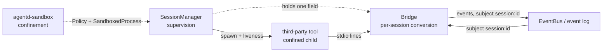
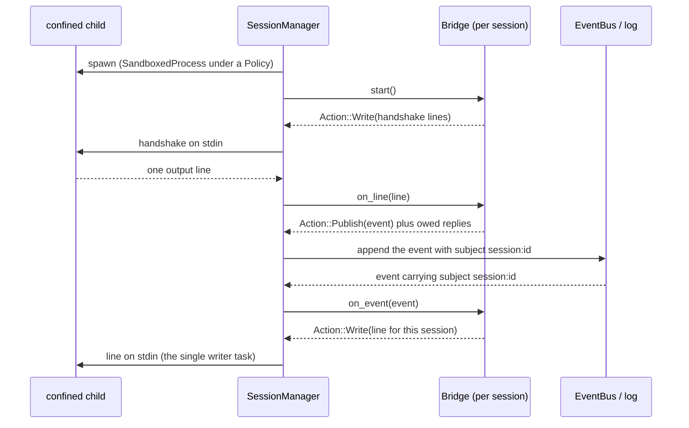

# agentd session design

The daemon supervises third-party tools: it runs them confined by an OS sandbox,
keeps them alive under a restart/lifetime policy, and gives them a face on the
event bus so they participate in the choreography even though they do not speak
CloudEvents themselves. This document fixes the roles that make that up and the
names for them, so the conversion layer does not become a property of the
supervisor.

## Goals and non-goals

Goals:

- A third-party tool (an MCP server, a language server, a CLI) can be run as a
  confined, supervised child process and take part in the event choreography.
- The supervisor stays protocol-agnostic: adding a protocol does not touch it.
- Process ownership, OS confinement, and protocol conversion are three
  orthogonal roles with separate contracts.
- The daemon's tokens and the `authority` claim stay on the daemon side; a child
  never holds network credentials and never approves its own command.

Non-goals:

- Turning children into event-bus peers. A child that speaks CloudEvents over the
  daemon's WebSocket (`agentd-node`) is already a first-class participant and
  needs no Bridge; that path is unchanged.
- A per-session mailbox with its own routing table. The durable log is the
  mailbox; the bus is the delivery surface. A second routing plane is not built.
- A worker pool. Third-party tools are not interchangeable — each has its own
  protocol — so they are supervised individually, not pooled.

## Roles

Three roles, orthogonal, one contract each. The point of the split is that the
conversion layer can be swapped without touching supervision, and supervision
can be swapped without touching conversion.

| Role              | Contract                          | Crate            |
| ----------------- | --------------------------------- | ---------------- |
| Confinement       | "given a `Policy`, run something isolated" | `agentd-sandbox` |
| Supervision       | "own one child: spawn, liveness, restart, lifetime" | `agentd` (`session`) |
| Conversion        | "translate between a byte stream and CloudEvents" | `agentd` (`session`) |



The bus is the actor system. The log is the mailbox; `EventBus` is the fanout.
A node that speaks CloudEvents is a first-class actor on it. A third-party tool
is a peripheral device with a fixed protocol; a **`Bridge`** is the facade that
gives it an actor-shaped face. So the actor is the Bridge (and the bus), never
the child.

## Names

"Session" named two different things, which was the root of the naming
difficulty:

- `agentd_sandbox::Session` was a long-lived confined process with piped stdio.
  It had no type name at the manager level (`agentd::session` names the manager,
  not the unit).
- `agentd::session::SessionManager` supervises those units.

The fix was to separate the three roles by name and by type:

- **`SandboxedProcess`** (renamed from `agentd_sandbox::Session`): the child
  process, its pipes, and the profile/scratch it was spawned under. This is the
  mechanism.
- **`SessionManager`** owns the lifecycle and holds an
  `Option<Arc<dyn Bridge>>`. The manager never names a protocol, so a new
  protocol does not touch it.
- **`Bridge`** = the conversion. Bidirectional and symmetric, so one word
  covers both directions.

A dedicated `Session { SandboxedProcess, Bridge }` struct was designed and then
deleted: nothing needed a second name for the pairing, and the manager — the
only holder — holds the bridge directly. "Session" now names the manager's
domain and its `session.*` events, not a Rust type.

`Bridge` is chosen over the alternatives for three reasons: the direction is
symmetric (a child-to-bus *uplink* and a bus-to-child *downlink* are both
"bridging"), the concrete type is named after the protocol (`McpBridge`, and a
future `LspBridge`), and the name does not claim the manager knows the protocol.
`Driver` is avoided because it collides with the tokio I/O driver; `Adapter` and
`Codec` were considered and lose the symmetry or sound byte-level.

Vocabulary that is reserved, not used here:

- **actor** — the bus, the log, and CloudEvents-speaking nodes. Not children.
- **worker** — a later, interchangeable pool over one protocol. Nothing today
  is interchangeable.

Child-side nouns, to be chosen deliberately when a consumer appears: `Tool`
if "third-party tool" is the protagonist, `Workload` if the generality of
confinement is. The name should not imply more capability than the child has.

## Bridge contract

```rust
pub trait Bridge: Send + Sync {
    /// A stable label for the protocol, recorded on every event.
    fn protocol(&self) -> &'static str;
    /// Lines to write once the child starts; empty when there is no handshake.
    fn handshake(&self) -> Vec<String>;
    /// One child output line -> an event, plus any protocol replies it owes.
    fn uplink(&self, line: &str) -> Option<Conversion>;
    /// An event routed to this session -> a line to write, or `None`.
    fn downlink(&self, event: &Event) -> Option<String>;
}
```

The methods are synchronous because they are pure conversions of one already
delimited line; all I/O and task orchestration stays in the manager. `uplink` is
driven by the child's output; `downlink` by the bus. The manager takes the
child's `stdin` and `stdout` (`SandboxedProcess::take_stdin` / `take_stdout`,
see [sandbox](sandbox.md)) and drives them; it never inspects the bytes. A single
task owns the stdin pipe, fed by one channel that both the downlink watcher and
the uplink reader's replies write to, so no two writers interleave a frame.
`Conversion::to_child` carries protocol obligations that follow a response
(for example MCP's `notifications/initialized`), so the handshake is a two-step
exchange the bridge can describe without holding a pipe.

A `Bridge` is per-protocol. `McpBridge` is the first: it frames the Model
Context Protocol, newline-delimited JSON-RPC 2.0, opens with `initialize`, and
answers the server's response with `notifications/initialized`. The manager holds
`Option<Arc<dyn Bridge>>`; with no bridge the process is a `CloudEvents` peer and
its pipes are left untouched.

The design originally floated a `Session { SandboxedProcess, Bridge }` struct and
a minimal `StdioBridge`; both were deleted as speculative. The manager already
owns the lifecycle and is the only thing that needs the bridge, so it holds one
field directly, and a protocol-less tool needs no bridge at all — it is the
`run_shell`/peer case.

## Event provenance

The daemon appends events on behalf of a child, so `source` alone cannot say who
produced them. The bus stays single-sourced at `urn:mokmokd`
(`DAEMON_SOURCE`), and identity moves to `subject`:

| Attribute | Value                                                            |
| --------- | --------------------------------------------------------------- |
| `source`  | `urn:mokmokd` — everything on this log is daemon-mediated        |
| `subject` | the session id the child runs under (`session:<id>`)             |
| `type`    | `session.*` lifecycle, or a protocol-family prefix for payloads  |

A `Bridge` stamps `subject` from its session on every event it emits, so a
consumer can route or filter by session without a second routing table. Giving
each child its own `source` was rejected: provenance would then live in two
places (source for children, subject for everything else), and the daemon would
lose the ability to say "the daemon mediated this".

`subject` is an optional CloudEvents attribute, added to `Event` as a field with
a `skip_serializing_if` and set through `Event::with_subject`, the same shape as
`time`. It is not part of `set_provenance`: the daemon owns `source` and `time`
on ingress, but `subject` belongs to the producer (the Bridge) and survives a
relay.

The collision the design flagged is resolved: the sandbox's session and
permission events carried a `data.subject` field holding the *command string*;
that field is now `data.command` (`agentd-sandbox/src/events.rs`), so the word
`subject` names only the context attribute.

## Routing and backpressure

Downlink routes by `subject`. A `Bridge` emits, and a client addresses, an event
whose `subject` is `session:<id>`; the manager's downlink watcher forwards only
events whose `subject` matches its own session, so two bridged sessions of the
same protocol never receive each other's messages. The child does not get a
mailbox of its own: the log already holds every candidate, and downlink is a
filtered projection of it. Type-based selection (`Interest` / `TypePrefixes` in
`agentd-node/src/filter.rs`) remains available for a future bridge that wants it,
but `subject` is what the first one needs and uses.



Uplink must not flood the log. The manager reads the child's stdout line by line
and drops any line longer than `MAX_FRAME_BYTES` (64 KiB) rather than appending
it, so a stream that never yields a frame is bounded. Framing (what counts as one
message) is the `Bridge`'s job precisely because only it knows the protocol.

## Relationship to the existing session manager

`agentd::session::SessionManager` already owns process liveness, restart, and
lifetime against the durable log, and reconciles on startup by failing any
session the previous daemon left open (see [sandbox](sandbox.md#sessions)). It
stays the supervisor. What changes is only that its unit becomes
`Session { SandboxedProcess, Bridge }` instead of a raw process, so supervision
and conversion stop being entangled.

`agentd-node` is deliberately *not* downgraded to a stdio child. It already
speaks CloudEvents and authenticates as a peer, so it needs no Bridge and the
two models would otherwise duplicate. A Bridge is for tools that cannot speak
the protocol, and only those.

## Testing strategy

- **Bridge unit tests**: the handshake shape, a notification and an
  `initialize` response converting to events, the `notifications/initialized`
  reply it owes, blank/non-JSON/foreign messages ignored, and downlink rendering
  only this protocol's messages (see `agentd/src/bridge.rs`).
- **End-to-end bridge tests**: a real child on `/bin/sh` completes the MCP
  handshake and one notification over the log with `subject: session:<id>`, and
  an outbound event addressed to the session is echoed back as an inbound event
  (see `agentd/src/session.rs`).
- **Routing and cap tests**: the downlink watcher forwards only its session's
  `subject`; an oversized line is dropped rather than appended.
- **Supervision regression**: existing `agentd::session` tests (lifecycle,
  restart budget, lifetime kill, status, startup reconciliation) pass unchanged,
  and the unbridged path leaves the child's pipes untouched.

## Implementation status

Implemented: the `SandboxedProcess` rename; the `subject` attribute on `Event`
with `with_subject`; the `data.subject` -> `data.command` rename in the sandbox
events; the `Bridge` trait and `McpBridge` (`agentd/src/bridge.rs`); the
manager's `Option<Arc<dyn Bridge>>`, handshake, line-framed uplink, single-writer
downlink, subject routing, and frame cap; and the `--session-bridge mcp` daemon
flag. All of it is behind the `sandbox` feature.

Not built: `LspBridge` or any second protocol, a `StdioBridge` for protocol-less
tools, type-based (`Interest`) downlink selection, and correlation of JSON-RPC
request/response ids into typed events. The `agentd-node` CloudEvents peer path
is unchanged.
