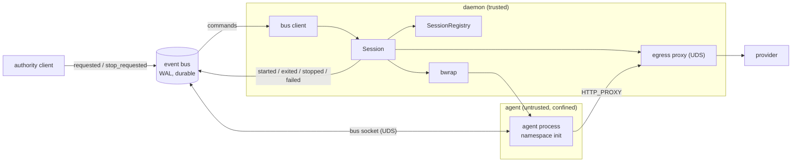

## About

This document set specifies the session manager for the 24/7 agent described in
[vision.md](../vision.md).

A **session** is one confined agent process, one workspace, and one egress
allowlist, with a lifetime the daemon owns. The agent is a purpose-built Rust
crate in this workspace, not a third-party program. It runs inside the
[sandbox](../sandbox/README.md) and is a client of the
[event bus](../event-bus/README.md), so it subscribes to its own input and
publishes its own output. The session manager starts the agent, confines it,
supervises it, and tears it down. It does not relay bytes between a client and
the agent.

## Topics

| Document | Topic |
| --- | --- |
| [agent.md](./agent.md) | The image, the session, and the purpose-built agent. |
| [lifecycle.md](./lifecycle.md) | The session state machine, the registry, teardown, restart, and authority. |
| [daemon.md](./daemon.md) | The daemon that composes the sandbox and the bus, and the egress wiring. |

## Context and Goals

The project has a durable event bus and a kernel-enforced sandbox, and the two
do not meet. The bus publishes, subscribes, and persists, but it executes
nothing. The sandbox confines a command and records what it decided, but it owns
no live sandbox and exposes seams (`Approver`, `Publisher`) that no process
implements. Nothing in the repository constructs an egress proxy, opens a
session, or spawns a confined process outside its own tests.

The agent this project wants to run is a long-lived coding agent that acts on its
own. A third-party agent program is a poor fit for the sandbox, because it needs
a terminal and it hides its decisions. A purpose-built agent reads its input from
the bus and writes its output to the bus, so the log is the record of what it
did, and the sandbox is the boundary on what it could do. That pairing is the
reason the session manager exists.

Goals:

- Run a purpose-built agent inside the sandbox, one session per workspace.
- Give each session a durable identity on the bus, so its events are replayable
  and its input is a subscription rather than a stream of bytes.
- Own the session lifetime from start to teardown, including the confined
  process, its scratch space, and its egress allowlist.
- Wire the egress proxy's decisions to the bus, so an unlisted destination
  becomes a request an authority answers, matching
  [sandbox permissions](../sandbox/permissions.md).
- Keep the `sandbox` and `agent` crates independent. The composition lives in a
  new crate.

Non-goals:

- A terminal or a PTY. No human attaches to a session's standard input or
  output.
- Streaming a session's raw standard output or standard error over the bus. An
  agent that wants a human to watch publishes progress events it controls.
- A third-party agent adapter. A purpose-built agent replaces it.
- A memory or CPU ceiling the kernel does not enforce. See
  [sandbox security](../sandbox/security.md).
- Cross-host sessions. A session runs where its daemon runs.

## Requirements

Functional:

- Open a session from an image and a workspace root, and confine the agent under
  a policy built from that image.
- Grant the agent a bus connection so it subscribes to its input and publishes
  its events.
- Record the session's lifecycle as durable events on the bus.
- Answer an unlisted egress destination through the approval flow the sandbox
  already defines.
- Stop a session on request, and tear down its process tree, its scratch, and
  its proxy.
- Reproduce the committed lifecycle after a daemon restart.

Non-functional:

- Fail closed. A session whose policy, backend, proxy, or bus connection cannot
  be established does not run.
- The kernel is the boundary for the filesystem and the network, and the proxy
  is the boundary for destinations. The session manager adds no in-process check
  that is claimed as a guarantee.
- The daemon never holds the agent's provider credentials. The tunnel is opaque
  and TLS stays end to end.
- A confined agent runs as the daemon's user, so it holds no bus authority. It
  can ask, and it cannot approve its own ask.

## Assumptions

- The host provides bubblewrap. The sandbox fails closed on a host that does
  not, and so does the session manager.
- The event bus is the control and audit plane for a session, for both its
  lifecycle and its egress decisions.
- The agent is trusted code in the sense that this project wrote it, and untrusted
  in the sense that a model drives it, so it runs confined.

Unresolved decisions are tracked in [Open Questions](#open-questions).

## Architecture Overview

Three boundaries decide what a session can do. The kernel fixes the filesystem
and the network reach at spawn. The egress proxy decides which destinations are
reachable. The bus decides which events are authoritative. The session manager
sits on the trusted side and owns the first two while it listens to the third.



| Layer | Responsibility | Document |
| --- | --- | --- |
| `image` | The session template: policy builder, program, output contract. | [agent.md](./agent.md) |
| `session` | The `SessionId`, the state machine, and the registry. | [lifecycle.md](./lifecycle.md) |
| `lifecycle` | Start, observe, stop, and tear down one session. | [lifecycle.md](./lifecycle.md) |
| `egress` | The proxy serve loop and the `Publisher` and `Desk` seams. | [daemon.md](./daemon.md) |
| `bus client` | Subscribe to commands and publish lifecycle events. | [daemon.md](./daemon.md) |

The central separation is between the session and the agent:

- The **session manager** decides whether the agent runs, under which policy,
  on which workspace, and for how long. It is trusted.
- The **agent** decides what work to do within that boundary. A model drives it,
  so it is untrusted and confined.

The agent reaches the bus over a Unix socket the policy grants, so it is a bus
peer with its own subscription and its own cursor. The manager does not relay
the agent's input or output. It starts and stops the peer.

## Proposed Module Layout

A new crate holds the session manager, because it is the one place that depends
on both the `sandbox` crate and the `agent` crate, and keeping it separate leaves
each of those crates at one boundary. See [daemon.md](./daemon.md) for the
placement decision and the alternative.

```
daemon/src/
  lib.rs
  image/       AgentImage, the policy builder, the output contract
  session/     SessionId, Session, SessionRegistry, the state machine
  backend/     backend detection, the executor calls, the scratch guard
  egress/      the proxy serve loop, Publisher, Desk
  bus/         the client connection, subscribe and publish, authority
daemon/bins/
  agentd       the daemon binary
```

The `agent` crate stays a pure bus, and the `sandbox` crate stays free of the
bus. Neither gains a dependency on the other.

## Phased Implementation Milestones

1. Executor grants and streams. The bubblewrap renderer binds each granted
   `network.unix_sockets` entry, so a confined agent can reach the bus. The
   long-lived `Process` gains a configurable standard input and output through
   `ProcessStdio`, and `Scratch` becomes unique per session. **Landed.** Tested
   over a real `bwrap` and without confinement.
2. Session core. The `SessionId`, the state machine, and the registry, with no
   process spawning. **Landed**, in the new `daemon` crate. Tested as pure
   transitions.
3. Egress wiring. The proxy serve loop and the `Publisher` and `Desk`
   implementations over the bus. An unlisted host becomes a `requested` event,
   and a grant lets the tunnel through. **Landed**, in `daemon/src/bus.rs`,
   `daemon/src/egress.rs`, and `daemon/src/helper.rs`: the bus client and
   `Publisher` bridge are verified against the real bus server, and the
   per-session proxy binds, serves, and is torn down with its session.
4. Daemon. The image, the start sequence, the lifecycle events, and teardown
   landed in `daemon/src/image.rs`, `daemon/src/launcher.rs`, and
   `daemon/src/manager.rs`, tested with a fake launcher. The real
   `SandboxLauncher` and the egress helper resolution followed, and a confined
   shell script writing inside its workspace and denied outside it is the
   end-to-end proof. **Landed.** The egress proxy's serve loop completed the
   milestone: a session that grants egress binds a proxy, serves it, and removes
   its socket on teardown. Tested over a real Unix socket.
5. Agent. The in-repo agent crate. It subscribes to the bus, acts on a message,
   and publishes its events. **Landed**, as the `agentd` crate and the
   `agent-agent` binary: a bus peer with its own cursor, one command contract
   (`agent.session.command` / `agent.session.output` scoped by the subject), a
   dedup on the event id because delivery is at-least-once, and a **`shell`**
   capability that runs an argv in the session's workspace with bounded output and
   a timeout. The capability is a trait, so the model-driven one in milestone 6
   replaces it without touching the loop.
6. Coding agent image. The provider host on the allowlist, the workspace
   convention, and the task events. This is where the authority-socket question
   in [lifecycle.md](./lifecycle.md#authority) becomes a requirement. Three units
   have **landed**: the operator declares the OpenAI-compatible endpoints in a
   settings file (`$XDG_CONFIG_HOME/agent/config.toml`), whose `base_url`s derive
   the session's egress allowlist (`daemon/src/settings.rs`); the daemon composes a
   session's argv and model environment from that file, so an agent image is
   launched with the flags that name its model, its endpoint, and the variable
   holding its key; and the agent drives that endpoint through the session's egress
   proxy, in `agentd/src/openai/`. See
   [agent.md](./agent.md#the-settings-and-the-egress-allowlist),
   [agent.md](./agent.md#the-image-at-launch), and
   [agent.md](./agent.md#the-client). The workspace convention and the task events
   remain.

## Open Questions

- Does `subscribe` gain a working `filter`, or does the agent filter on the
  client side? The wire `filter` field is accepted and ignored today, so a
  subject filter is not implemented.
- Is the committed lifecycle enough to rebuild a session after a restart, or
  does a session need a snapshot? A live process does not survive the daemon, so
  a rebuild re-creates the process from the last committed state.
- How does the session guarantee the authority socket's directory is absent from
  the confined agent's view, given the broad read grant? The default is a `deny`
  entry over the authority socket's directory, which masks it. A general
  guarantee is still open.
- Does the agent use the ordinary bus listener, or a dedicated one per session?
  The ordinary listener is gated by the peer UID and GID, and the agent shares
  the daemon's user.
- What stops two sessions from binding the same workspace root read-write at
  once? The registry can refuse a second live session on one root, or allow it
  and let the two agents race.
