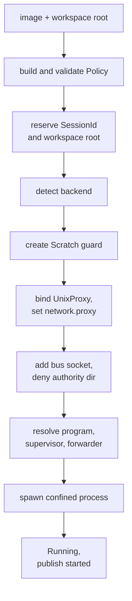
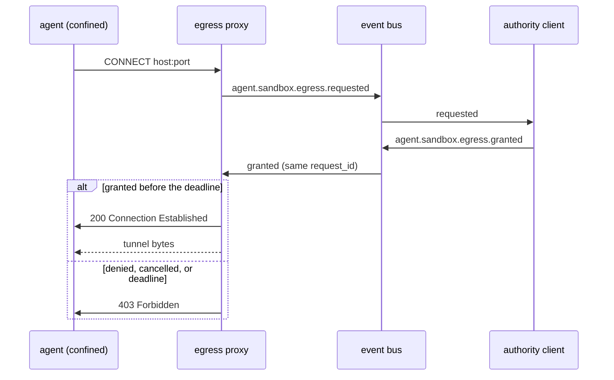

## The Daemon

The daemon is the one process that depends on both the `sandbox` crate and the
`agent` crate. It owns the session registry, the egress proxies, and the bus
connection, and it is the trusted side of every session.

It is the process the sandbox's design already names. The sandbox exposes
`Approver` and `Publisher` as seams and says the daemon implements them over the
bus, and no such daemon exists yet. See
[sandbox permissions](../sandbox/permissions.md).

## Placement

Two placements were weighed.

| Placement | Pros | Cons |
| --- | --- | --- |
| Extend the `agent` crate and its binary | Fewer crates. One process for the bus and the sessions. (Rejected.) | The bus crate gains a `sandbox` dependency, and it is the crate whose purity its verification depends on. |
| A new `daemon` crate (Chosen) | Each crate keeps one boundary. The `sandbox` stays free of the bus and the `agent` stays a pure bus. | A third crate and a third binary. |

The bus crate's verification rests on it being a small, self-contained state
machine over bytes. A `sandbox` dependency would put a process spawner inside it
and pull a bubblewrap renderer into the Kani scope. The daemon crate is one
crate, and it is the only place where the two meet, which is the whole point of
it.

## The Bus Client

The daemon holds one connection to the bus, with a fixed `subscriber_id`, and it
uses it for three things. It subscribes to the events it must act on. It
publishes the lifecycle of each session. It implements `Publisher` for the egress
approval flow, which is the seam the sandbox calls to publish an event and to
mint a `RequestId`.

The connection is what reuses the bus's durability. A `requested` event the
daemon publishes is committed before the proxy answers, so the approval record
survives a crash the same way every other event does.

The bus client is `daemon::bus::BusClient`. The transport is a WebSocket and one
connection must both read a long-lived subscription and write a publish, so the
connection runs on its own thread with a current-thread runtime; the public
methods are blocking, because the daemon and the sandbox are. `BusPublisher`
wraps the client as the sandbox's `Publisher`. Milestone 3 landed both, verified
against the real bus server over a Unix socket.

A second connection carries the authority claim, the same shape the bus already
defines: a listener whose path the confined agent cannot reach. It is needed once
the daemon publishes the egress *decisions* it resolves and the rule changes,
which the bus gates. The lifecycle events it publishes today are not gated. See
[event-bus security](../event-bus/security.md) and
[event-bus authority](../event-bus/README.md).

## The Start Sequence

Opening a session is one ordered sequence, and a failure at any step releases
everything the earlier steps acquired. The order is the order that fails closed.

1. Take the image and the workspace root, and build the `Policy`. Validate it
   before anything is created.
2. Reserve the `SessionId` and the workspace root in the registry, so a second
   session on the same root is refused here rather than after a process starts.
3. Detect the backend. If the host cannot confine, fail.
4. Create the `Scratch` guard.
5. If the image grants egress, bind the `UnixProxy` at a per-session socket path
   and set `policy.network.proxy` to that path and port. The proxy must exist
   before the policy renders, because the renderer requires the socket.
6. Add the bus socket to `policy.network.unix_sockets` and mask the authority
   socket's directory with a `deny` entry.
7. Resolve the program, the supervisor, and the forwarder on the trusted side,
   and refuse any binary inside a write root.
8. Spawn the confined process. See
   [session agent.md](./agent.md#the-policy-grants-the-bus-socket).
9. Move the session to `Running`, register the proxy's serve loop, and publish
   `agent.session.started`.

Steps 1 through 7 are pure setup and can fail without a process to reap. Step 8
is the first step that can leave a running process, and from there teardown is
`Session::shutdown`. See [lifecycle.md](./lifecycle.md#teardown).

## Egress Wiring

The sandbox splits egress into enforcement and decision, and the daemon supplies
the decision half. The proxy is the enforcement point, and the bus is where the
decision is recorded.

The proxy needs an accept loop, because `UnixProxy` binds and serves one
connection at a time and the daemon owns the loop. The daemon runs one loop per
session, beside the session's process.

Two seams connect the proxy to the bus.

- `Publisher` publishes an authored event and mints a `RequestId`. The daemon
  implements it over the bus client. It is the only way the proxy writes to the
  log.
- `Desk` is the `Approver` the proxy consults. It publishes
  `agent.sandbox.egress.requested`, waits on a `request_id`, and records its own
  `cancelled` only on a deadline. The daemon resolves the `Desk` when it sees a
  correlated `granted`, `denied`, or `cancelled` on the bus.

The proxy's own `sandbox_id` in those events is the `SessionId`, so the egress
log and the lifecycle log for one session share a subject. See
[sandbox events](../sandbox/events.md).

The allowlist is mutable at runtime, and it is the one thing about a running
session that changes. An authority adds or revokes a `host:port` rule, and the
`Arc<Allowlist>` the session owns applies it to the next connection and closes a
tunnel a revoke covered. The policy itself does not change, because the mount set
is frozen at spawn. This is the reason the design puts destinations in the proxy
rather than in the kernel.

## What the Daemon Does Not Do

- It does not relay the agent's input or output. The agent is a bus peer with its
  own connection. See [session agent.md](./agent.md#the-agent-runs-as-a-bus-peer).
- It does not hold provider credentials. The tunnel is opaque.
- It does not enforce resource limits. The kernel does not, so the daemon does
  not claim to.
- It does not start a second session on a live workspace root.

## Testing Strategy

- **Start sequence.** A workspace root that is already live is refused before a
  process spawns. A missing bus socket fails closed. A policy that masks the
  authority socket is required.
- **Backend.** A host without bubblewrap refuses the session, matching the
  sandbox's fail-closed rule.
- **Egress end to end.** Over a real Unix socket, an unlisted host publishes
  `requested`, a correlated `granted` lets the tunnel carry bytes, and a
  `denied` answers `403`. A revoked rule closes a live tunnel.
- **Lifecycle.** Over a real bus and a confined stub agent, `requested` yields
  `started`, a stop yields `stopped`, and an agent that exits on its own yields
  `exited`. A terminal session ignores a second stop.
- **Authority.** A client without the claim cannot publish `requested` or
  `stop_requested`. The confined agent cannot reach the authority socket.
- **Restart.** A session that was `Running` at shutdown is reported `Exited`
  with a restart reason on replay, and a client can reopen it.
