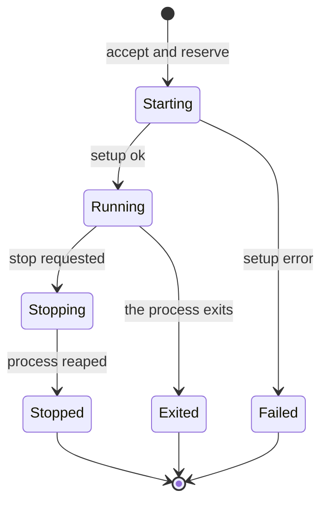

## Lifecycle

A session is a state machine with a terminal state, not a set of flags that must
stay in sync. The state is one value, and every transition is one function, so an
invalid state cannot be represented and a caller cannot half-start a session.

## The States

| State | Meaning | Terminal |
| --- | --- | --- |
| `Starting` | The session was accepted and its resources are being created. | no |
| `Running` | The agent process is alive. | no |
| `Stopping` | A stop was requested and the process is being reaped. | no |
| `Stopped` | The process was stopped on request. | yes |
| `Exited` | The process ended on its own. | yes |
| `Failed` | The session could not start. | yes |

## The Transitions



A terminal state accepts no further transition.

| From | Trigger | To | Work |
| --- | --- | --- | --- |
| none | `SessionRegistry::insert` | `Starting` | Reserve the id and the workspace root. |
| `Starting` | policy rendered, backend confined, proxy bound, bus reachable, process started | `Running` | Publish `agent.session.started`. |
| `Starting` | any setup error | `Failed` | Release the reserved resources, publish `agent.session.failed`. |
| `Running` | the process exits | `Exited` | Publish `agent.session.exited`. |
| `Running` | `Session::stop` | `Stopping` | Send `SIGKILL` to the backend. |
| `Stopping` | the process is reaped | `Stopped` | Publish `agent.session.stopped`. |
| any terminal | a further trigger | unchanged | Ignored. A terminal session accepts no transition. |

Two properties fall out of the machine, and each is a test:

- A session that failed setup never reports `Running`, so a consumer that waits
  for `started` cannot hang on a session that will never start.
- A `stop` on a terminal session is a no-op, so a client that stops a session
  twice does not stop a second process.

## The Registry

`SessionRegistry` maps a `SessionId` to a `Session`, beside the one lock that
guards both. It is the single owner of session writes, because the daemon's
handler and the reaper both act on a session and neither may drive the other's
state.

```rust
pub struct SessionId(String);

pub struct Session {
    state: State,
    workspace: PathBuf,
    scratch: Scratch,
    process: Option<Process>,
    egress: Arc<Allowlist>,
}

pub struct SessionRegistry { /* Mutex<HashMap<SessionId, Session>> */ }
```

The pieces a `Session` owns are the pieces that must die with it. `Scratch`
removes its directory on drop. `Process` holds the confined child. The
`Arc<Allowlist>` is shared with the proxy that serves the session, so revoking a
rule reaches a live tunnel.

`SessionId` is derived from the bus subject, so the id a client uses is the id
the log carries. The daemon mints it from the `agent.session.requested` payload,
which carries the session the client wants, and refuses a second live session
with the same id.

A workspace root is reserved while a session is live. A second session on the
same root is refused unless the first is terminal, because two agent processes
writing one read-write root is a race with no defined outcome. The two policies
are to refuse the second session or to allow it and accept the race. The design
refuses, and records the choice.

## Teardown

Teardown is one function, `Session::shutdown`, and it is the only way a resource
is released. It runs in every terminal transition, so a normal stop, a crash, and
a failed start all release the same things in the same order.

1. Send `SIGKILL` to the backend. The backend is the PID namespace's init, so
   the kernel kills the agent and every descendant. See
   [sandbox supervisor](../sandbox/supervisor.md).
2. Reap the process and record its outcome.
3. Drop the `Scratch` guard, which removes the directory.
4. Remove the session from the registry and publish the terminal event.

The order matters in one place. The process is killed before the scratch is
removed, because a running agent must not observe its own `TMPDIR` disappearing
under it.

## Restart

A live process does not survive the daemon. A session that was `Running` when the
daemon died is therefore not `Running` when the daemon returns. The daemon
rebuilds its in-memory state by replaying the committed lifecycle events from the
log:

- A session whose last committed state is terminal stays terminal.
- A session whose last committed state is `Running` is reported `Exited`, and
  the log gains an `agent.session.exited` event with a reason that says the
  daemon restarted.
- A client reopens the session, which the manager treats as a new session on the
  same workspace.

The alternative is to re-create the process automatically on restart. The design
does not, because a rebuilt process has no memory of what the previous one was
doing, and an agent that resumes a task it cannot remember is worse than an agent
that starts clean. The log makes the decision explicit, and the client decides.

Replay is from the sequence where the daemon last acknowledged, with
`subscriber_id` fixed for the manager. See
[event-bus delivery](../event-bus/delivery.md).

## Authority

Starting a session and stopping a session are privileged, so the manager gates
both on the bus authority claim. A confined agent holds that claim only if it can
reach the authority socket, and the design keeps the agent away from it.

The agent reaches the ordinary listener, which serves its subscription and its
own output. The authority socket's directory is a `deny` entry in the agent's
policy, so bubblewrap masks it and the agent cannot open it. This mirrors the
sandbox's own rule for the authority socket in
[sandbox permissions](../sandbox/permissions.md) and
[sandbox events](../sandbox/events.md).

| Event | Authority required |
| --- | --- |
| `agent.session.requested` | yes |
| `agent.session.stop_requested` | yes |
| `agent.session.<id>.command` | yes |
| `agent.session.<id>.output` | no |
| `agent.session.started` / `stopped` / `exited` / `failed` | no, the manager publishes them |

The manager's own lifecycle events are not gated, because the manager is the only
writer and it runs on the trusted side. The gate exists to stop the confined
agent from acting on its own.

The guarantee is conditional today. A `deny` over the authority socket's
directory masks it under bubblewrap, and the sandbox's open question about a
general hiding rule remains open. Until it is settled, the manager's fail-closed
rule is that a session does not start if the authority socket's directory is not
under a `deny` in its own policy.
